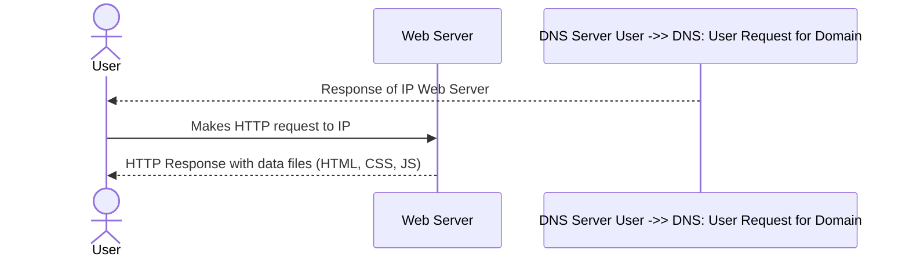
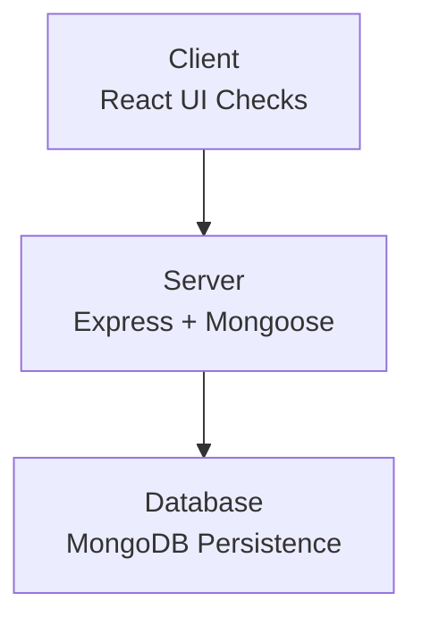
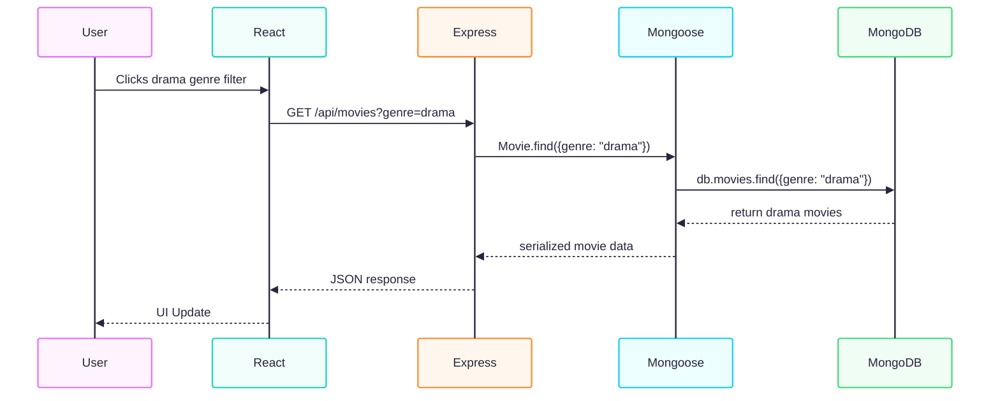
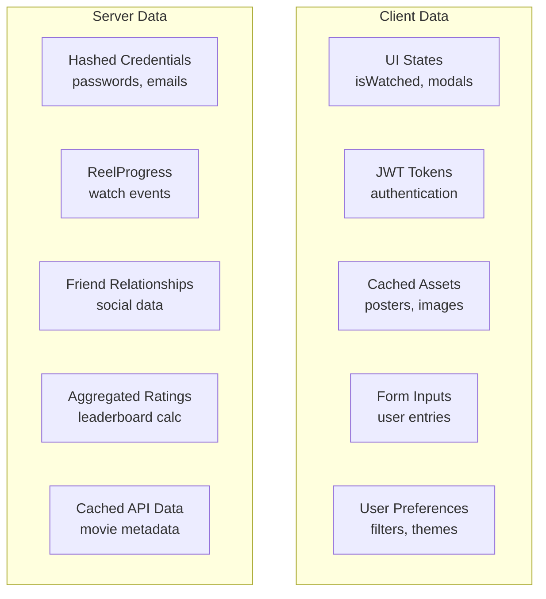
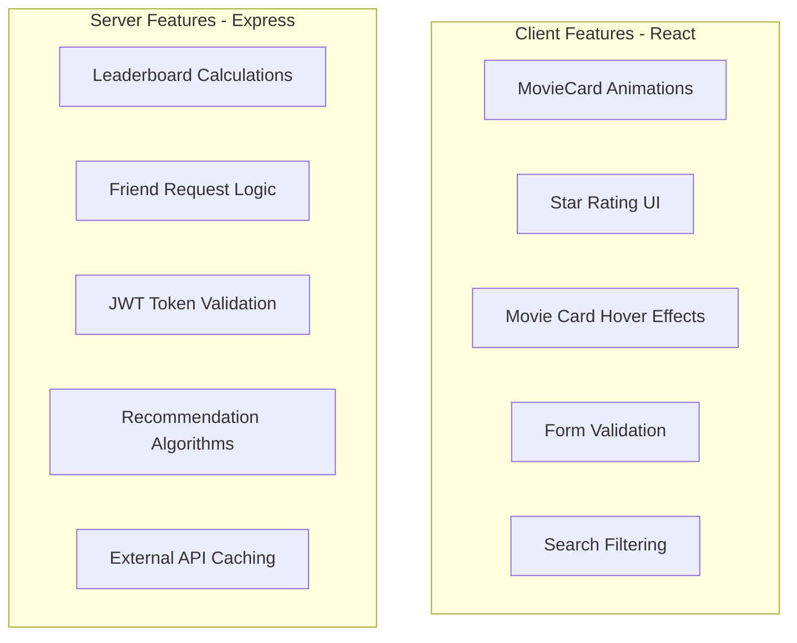
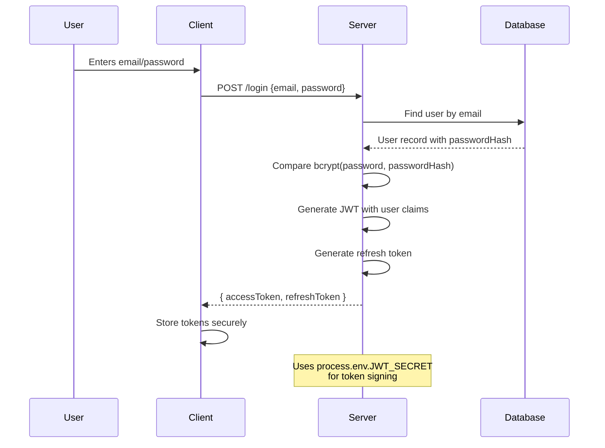
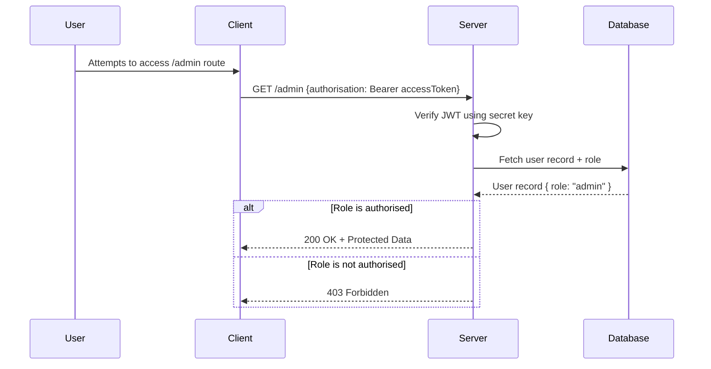
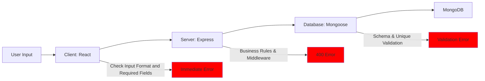

# Client-Server Architecture

Client-Server architecture has been a standard of web communication since the late 1980s, when networks moved away from mainframe systems towards interconnected personal computers. This model connects multiple client devices to centralized servers that manage shared data resources and services (ScienceDirect, 2025)[^1].  
In modern web applications, this model operates in a layered approach: a user enters a URL into their device's browser (client), the client contacts a DNS server to convert the URL to an IP, the client sends an HTTP request to the server at that IP address, the server responds (with HTML, CSS, Javascript, media etc), and finally the client renders the response (GeeksForGeeks, 2025)[^2]. That's already two layers of client server architecture in action: DNS resolution, followed by HTTP communication.  
Developers use this model to distribute data and features, allowing for quick execution and display of web content, and for authorisation and validation to ensure data is secure and correct.

See below diagram for typical client server interaction:



Our application implements this pattern through a three-tiered client-server architecture model (DataForest, 2025)[^3]:

- **Tier 1 (Presentation):** `React` is used for the client front-end framework
- **Tier 2 (Application):** `Express` is used as the server for business logic and database manipulation
- **Tier 3 (Data):** MongoDB is the database layer, with `Mongoose` providing validation and data modelling



Below we will discuss the key features of the client-server architecture model, and how they will be implemented in our application.

---

## Communication

Client-server communication, in general, occurs through the use of standardised HTTP verbs to define the intent of requests. RESTful applications use this approach due to its advantages of stable and predictable behaviour, simple implementation, and high level of support across web platforms (Das S, 2025)[^4]. In web applications the standard verbs are:

- `GET`: Retrieve data
- `POST`: Create new resources
- `PUT`: Updates the entirety of an existing resource
- `PATCH`: Partially updates an existing record
- `DELETE`: Remove resources

Other HTTP verbs which are less often used, or execute advanced tasks are: `HEAD`, `TRACE`, `OPTIONS` and `CONNECT` (Mozilla Developer Network, 2025)[^5].

Headers are also used to carry metadata such as authentication and authorisation, content type, caching, and any other useful information not necessarily included in the request/response body (Postman, 2025)[^6].

Server-side middleware is used to act on requests from the client, and manipulate database records. Responses are then sent back to the client.

In our application:

- `React` frontend sends requests and user input, and manages UI states (`React`, 2025)[^7]
- `Express` middleware handles application logic, routing, and error handling (`Express`.js, 2025)[^8]
- `Mongoose` performs MongoDB database operations and manipulation as required by request type
- `Express` sends a JSON response to the `React` frontend, which renders components and updates UI states

Examples of HTTP verbs in our application:

```js
// GET - Fetch user's Reel Canon progress and movie data
GET /api/users/123/reel-progress
GET /api/movies?genre=drama

// POST - Create new ratings and friend relationships
POST /api/ratings { movieId: 456, rating: 5 }
POST /api/friends { friendId: 789 }

// PATCH - Update user profile and scratch progress
PATCH /api/users/123 { favoriteGenres: ['drama'] }
PATCH /api/progress/456 { isScratched: true }

// DELETE - Remove friends and user data
DELETE /api/friends/789
```

The below diagram shows the typical communication flow in our application:



---

## Data Distribution

Data distribution separates data between the client and the server, to optimise performance, scalability, and security (Zealousys, 2025)[^9]. Client-side caching allows for rapid access to previously loaded content, while server side data storage allows for robust validation and sanitisation, secure storage of encrypted private data, as well as any complex aggregations and business logic needed to be performed by middleware. A hybrid approach allows for smooth user experience and optimum performance (Sharma K, 2025)[^10].

In general data distribution looks like:

- **Client:** Temporary data, cached assets, authorisation/authentication tokens, user preferences, UI states and modals (generally overlay or pop ups)
- **Server:** Persistent data, secure credentials, logic dependent data

A diagram of data distribution in our application:



Examples of modals in our application:

```js
const [isLoginModalOpen, setIsLoginModalOpen] = useState(false);
const [isMovieDetailsOpen, setIsMovieDetailsOpen] = useState(false);
const [isRatingModalOpen, setIsRatingModalOpen] = useState(false);
```

---

## Feature Distribution

Feature distribution depends on your chosen data distribution model, and is essentially the "why" to the "how" of data distribution. Features act upon data, and apply business/presentation logic as required.  
Cached client side data enables faster loading of previously requested data, UI states are stored client side as they are temporary and user dependent (EG. what is open, what has been viewed, what has been entered in a form which hasn't been submitted), authentication/authorisation and session data is stored client side to allow persistent access to protected routes/endpoints (GeeksforGeeks, 2025)[^11].  
Server side data storage enables complex business logic and aggregations, secure storage, validation and authorisation/authentication of private data, and enables functionality of any shared or relationship dependent data (EG. friend requests, aggregated results, financial transactions).

Feature distribution in our application:



- **Client:** JWT Tokens held for access authorisation, movie metadata stored for faster loading, UI states stored (EG. `isWatched()` is user dependent), UI presentation data is stored
- **Server:** Hashed credentials are stored for increased security, ReelProgress is stored to be used for aggregate functions and leaderboards, friend relationships are stored due to being directly connected to Users and to Comparison lists, cached external API data is stored to ensure faster loads to users of our application

Note: Authentication/authorisation in our application uses client-side JWT storage for efficient development, with plans to implement more secure httpOnly cookies for production deployment (Matharu M, 2025)[^12].

---

## Authentication & Authorisation

Authentication and authorisation are related but distinct processes:

- **Authentication:** _"Who is this entity"_. Handles identity verification of entities (users, devices or machines)
- **Authorisation:** _"What can this entity do?"_ Occurs **after** authentication, determining permissions by denying or granting access to protected routes, functions or resources

Authentication in our application means checking a user's email and password against hashed values, and issuing JWT tokens on success:



- **Client:** Sends credentials to the server over secure HTTPS, receives JWT access and refresh tokens and stores them
- **Server:** Validates credentials using Bcrypt and specified salting values, uses securely stored custom environment variables (`JWT secret`) to generate JWT tokens, sends created tokens back to the client

Authorisation in our application determines which routes and functions are accessible to users. Tokens generated during authentication are attached to requests (through `Bearer Token` headers), and the server checks their validity, expiry, and any role based privileges before granting access:



- **Client:** `React` client sends access tokens (JWT) in header of request, attempts to access protected routes, if valid, receives protected data and/or accesses protected behaviours
- **Server:** Verifies JWT tokens signature and expiry, checks user roles or privileges (e.g. `isAdmin = True`), allows or denies access accordingly

**Technical Note:** Our plan for authentication implements `bcrypt` hashing, with `Node.js` `crypto` available as a native alternative for future cryptographic needs to protect against any package security concerns.

## Validation

Validation uses both client and server layers, client-side validates things like form inputs (required fields, formats and password complexity) to reduce wait times, and provide an initial layer against data corruption. Server-side validation occurs after, ensuring anything missed from the client-side validation does not make it to the database. We are using a three-tiered approach, where `Mongoose` provides schema validation for data sets, ensuring consistent user experience despite MongoDB and NoSQL flexibility (Mozilla Developer Network, 2025; Kumar V, 2024)[^13][^14].

Validation in our application:

- **Client:** `React` validation ensures that all required fields are submitted and correct format and complexity (EG. email must be correct format `email@email.com`, passwords must be sufficiently complex `VeryComplexPassword1999!`)
- **Server:** `Mongoose` validation ensures all data is valid and secure, handles errors due to conflict across multiple records (EG. `unique`, `nullable` requirements), ensures private data is never exposed through the use of strict `Mongoose` Schema

A typical validation flow in our application is pictured below:



Note: `Mongoose` provides application-level schema validation, future development _could_ include the use of MongoDB database-level schema validation as a final defense against malicious or corrupt data which bypasses application checks.

---

## References

[^1] ScienceDirect. (2025). _Client-Server Architecture_. Elsevier. Available at: <https://www.sciencedirect.com/topics/computer-science/client-server-architecture> (Accessed: 29 September 2025)  
[^2] GeeksforGeeks. (2025). _Client-Server Model_. Available at: <https://www.geeksforgeeks.org/system-design/client-server-model/> (Accessed: 29 September 2025)  
[^3] DataForest. (2025). _Client-Server Model Glossary_. Available at: <https://dataforest.ai/glossary/client-server-model> (Accessed: 29 September 2025)  
[^4] Das, S. (2025). _Client-Server Communication: A Deep Dive_. LinkedIn. Available at: <https://www.linkedin.com/pulse/client-server-communication-deep-dive-sandip-das-zljcc/> (Accessed: 29 September 2025)  
[^5] Mozilla Developer Network. (2025). _Client-Server Overview_. MDN Web Docs. Available at: <https://developer.mozilla.org/en-US/docs/Learn_web_development/Extensions/Server-side/First_steps/Client-Server_overview> (Accessed: 29 September 2025)  
[^6] Postman. (2023). _What are HTTP headers?_. Postman Blog. Available at: <https://blog.postman.com/what-are-http-headers/> (Accessed: 29 September 2025)  
[^7] `React`. (2025). _`React`ing to Input with State_. `React` Documentation. Available at: <https://`react`.dev/learn/`react`ing-to-input-with-state> (Accessed: 29 September 2025)  
[^8] `Express`.js. (2025). _Using Middleware_. `Express`.js Documentation. Available at: <https://`express`js.com/en/guide/using-middleware.html> (Accessed: 29 September 2025)  
[^9] Zealousys. (2024). _Client-Server Architecture_. Zealousys Blog. Available at: <https://www.zealousys.com/blog/client-server-architecture/> (Accessed: 30 September 2025)  
[^10] Sharma, K. (2025). _Server-Side Caching vs Client-Side Caching_. Medium. Available at: <https://medium.com/@kumud.sharma.0206/server-side-caching-vs-client-side-caching-a-system-design-perspective-cf2ebae73c42> (Accessed: 29 September 2025)  
[^11] GeeksforGeeks. (2025). _Server-side Caching and Client-side Caching_. Available at: <https://www.geeksforgeeks.org/system-design/server-side-caching-and-client-side-caching/#what-is-clientside-caching> (Accessed: 19 September 2025)  
[^12] Matharu, M. (2025). _When Not to Use Local Storage: Risks, Examples and Secure Alternatives_. Medium. Available at: <https://meenumatharu.medium.com/when-not-to-use-local-storage-risks-examples-and-secure-alternatives-de541fed56d2> (Accessed: 30 September 2025)  
[^13] Mozilla Developer Network. (2025). _Form validation_. MDN Web Docs. Available at: <https://developer.mozilla.org/en-US/docs/Learn_web_development/Extensions/Forms/Form_validation> (Accessed: 19 September 2025)  
[^14] Kumar, V. (2024). _`Mongoose`_. Dev.to. Available at: <https://dev.to/vjygour/`Mongoose`-31jc> (Accessed: 30 September 2025)
