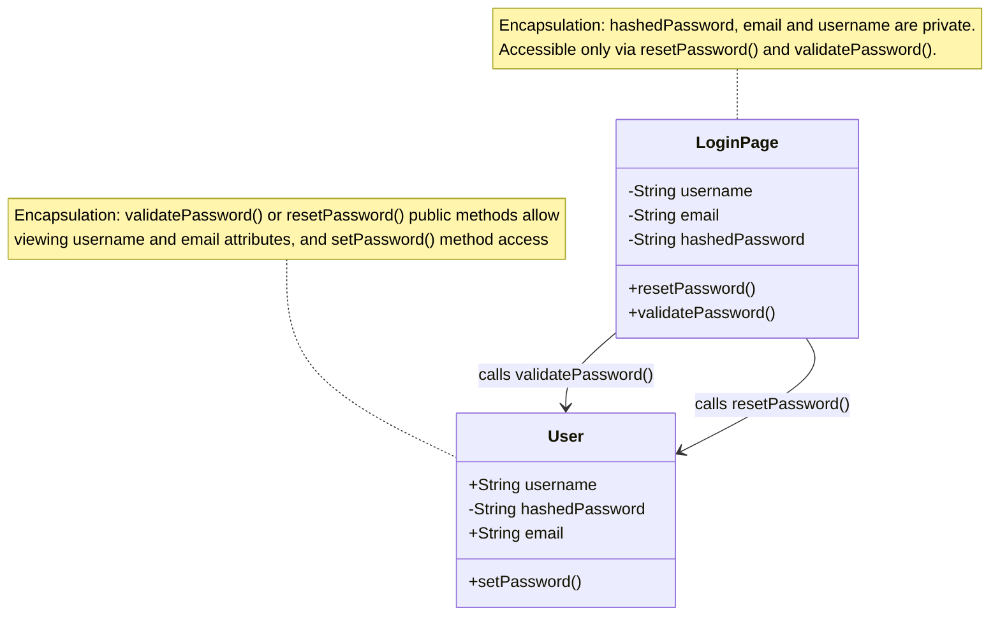
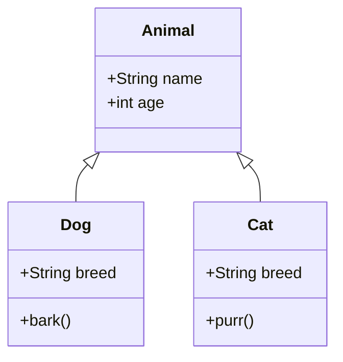

# Programming Paradigm

## Hybrid Approach: OOP Backend with Functional Frontend

At this stage of our application's development we are planning to use a hybrid approach of programming paradigms, choosing the most appropriate for different layers of the application:

- **Backend (Node.js, Express, Mongoose):** Object-Oriented Programming
- **Frontend (React):** Functional Programming with Hooks

The backend will define data models (e.g `User`, `Movie`, `Rating`, `Friendship`) using OOP principles to ensure validation and sanitisation, reusability, and maintainability. The frontend will be written with React functional components, where UI elements like **ReelCards**, **Popcorn Meter** and **Leaderboard Tables** are built as discrete functions, with states managed through hooks.

Ideally, custom hooks will be created to interact with data from the database, and render different UI based on conditional logic and user input. This functional programming will complement our OOP backend system, providing a strongly interactive UI, and enabling us to keep our business logic pure and simple.

For the purposes of this assessment, we will provide a thorough explanation of Object-Oriented Programming (OOP) as it is the foundation of our data models and application logic.

---

## Object Oriented Programming

Object Oriented Programming is a paradigm which structures code into objects (or **classes**) that bundle related data (attributes) and behaviours (methods) into modular units, aligning with our application entities, such as a `User` object that stores profile data and methods for authentication, or a `Movie` object which bundles metadata, critical ratings, and relationships to genres and directors.  
OOP promotes modular code organisation, reusability and maintainability through abstraction, encapsulation, inheritance and polymorphism (more on those terms and how they apply to _The Century Screening Room_ below!)

---

## The Four Pillars of OOP

The four key principles of OOP are referred to as _The Four Pillars_. They are a set of rules to follow when creating an application, in order to help write clean, efficient and maintainable codebases. Let's discuss The Four Pillars in detail below.

---

### Abstraction

Essentially, this is ensuring that overcomplicated details of your code are "hidden away" behind simple interfaces. Abstraction focuses on only exposing essential features, keeping your code DRY and readable. Without abstraction your code can will be full of repeated and complex function code, and with several complicated functions can be difficult to understand.

For example, if you have a coffee making application:

- Processes abstracted from the user in hidden methods:
  - "Boil water"
  - "Measure cofee beans"
  - "Adjust grind setting to coarse"
  - "Grind coffee"
  - "Add boiling water to coffee pot"
  - "Wait five minutes"
  - "Stir coffee"
  - "Wait three minutes"
  - "Press coffee plunger"
- After abstraction, the simple interface becomes:
  - "Make a French Press Coffee"

As a practical coding example, the below is **abstracted** complex logic hidden from the user inside a method:

```js
class CoffeeMaker {
  constructor(type, size) {
    this.type = type;
    this.size = size;
    this.isBrewing = false;
  }

  makeCoffee() {
    // Complex coffee-making logic hidden from the user
    this.boilWater();
    this.grindBeans();
    this.bloomCoffee();
    this.pourWater();
    this.isBrewing = true;
    return "Your coffee is ready!";
  }

  // Private methods (implementation details)
  boilWater() {
    /* complex temperature control logic */
  }
  grindBeans() {
    /* complex grinding settings logic */
  }
  bloomCoffee() {
    /* complex timing and pouring logic */
  }
  pourWater() {
    /* complex water flow control logic */
  }
}
```

Below is the **simple interface** that abstraction creates for the user:

```js
// Simple usage - the user just calls makeCoffee()
const myCoffee = new CoffeeMaker("French Press", "Large");
myCoffee.makeCoffee(); // All complexity hidden!
```

Abstraction is the design pattern, not the end result. Meaning that the class design _is_ the abstraction that hides complexity from the user.

In our project:

- The backend of our application will expose only high level methods (EG. `registerUser()` or `loginUser()`) while hiding security measures such as password hashing, validation or session (auth-token) logic.
- The frontend of our application will trigger a `markAsWatched()` call, while the backend handles updating of associated data (EG. `User` `ReelProgress` records are recalculated, and the Leaderboard is adjusted)

---

### Encapsulation

Encapsulation bundles data and methods which operate on the data within a single class or object, while restricting access to some of the objects components. This is achieved through the implementation of private properties and other modifiers.

Please see the diagram below to illustrate this concept:




An example of this is a user object which has a password as an attribute:

- A user must enter a password when registering or logging in
- The password is interacted with but **should never be stored as plain text, or directly accessible**
- Encapsulation ensures that password hashing occurs _within_ the `User` class, while only exposing safe methods such as `validatePassword()`

A practical coding example is below:

**Without Encapsulation:**

```js
// Dangerous - password exposed
user.password = "plaintext123";
console.log(user.password); // Anyone can read it!
```

**With Encapsulation:**

```js
const UserSchema = new mongoose.Schema({
  username: { type: String, required: true, unique: true },
  email:    { type: String, required: true, unique: true },
  passwordHash: { type: String, required: true }
});

// Encapsulation through schema methods
UserSchema.methods.setPassword = async function (plainTextPassword) {
  this.passwordHash = await bcrypt.hash(plainTextPassword, 12); // 12 salt rounds
};

UserSchema.methods.validatePassword = async function (attempt) {
  return await bcrypt.compare(attempt, this.passwordHash);
};
```

Encapsulation bundles data and methods within classes or schemas, and protects sensitive data through access and modification controls.

In our project:

- The `User` model will encapsulate passwords by storing them as hashed versions, and exposing only safe high level methods (EG. `validatePassword()`)
- Ratings are encapsulated within a `Rating` object, which ensures they are always linked with the related `User` and `Movie`.

---

### Inheritance

Inheritance is the passing of properties and methods from an existing _parent_ object to a new related _child_ object. This is helpful for almost all programming projects, as it promotes code re-use, keeping codeblocks DRY, and forms logical heirarchy for related objects.

Please see the below diagram to illustrate the concept of inheritance:




As an example, let's think use these classes: `Animal`, `Cat` and `Dog`.

- `Animal` is a parent class, as both `Dog` and `Cat` are animals.
- `Animal` has the properties: `name` and `age`
- `Dog` is an animal, so it inherits the properties `name` and `age` from the `Animal` object, but has the new properties `breed` and a new method `bark()`
- `Cat` is an animal, so it inherits the properties `name` and `age` from the `Animal` object, but has the new properties `breed` and `purr()`

A practical coding example is below:

```js
class Animal {
  constructor(name, age) {
    this.name = name;
    this.age = age;
  }
}

class Dog extends Animal {
  constructor(name, age, breed) {
    super(name, age); // Inherit from Animal
    this.breed = breed;
  }

  bark() {
    return "Woof!";
  }
}

class Cat extends Animal {
  constructor(name, age, breed) {
    super(name, age); // Inherit from Animal
    this.breed = breed;
  }

  purr() {
    return "Purrrr...";
  }
}

// Usage
const myDog = new Dog("Rex", 3, "Labrador");
console.log(myDog.name); // "Rex" (inherited from Animal)
console.log(myDog.bark()); // "Woof!" (Dog's own method)
const myCat = new Cat("Fluffy", 7, "Devon Rex");
console.log(myCat.age); // 7 (inherited from Animal)
console.log(myCat.purr()); // "Purrr..." (Cat's own method)
```

Inheritance allows classes to share attributes, properties and methods from their parent class.

In our project:

- A base `User` class could provide attributes (`username`, `email`, `password`) while child classes like `Admin` or `StandardUser` add role specific methods (EG. `viewAll()` methods for admins to see bulk data, and `removeUser()` to ban users)
- `List` objects (EG. _The Reel Canon_ vs _Custom Lists_) can inherit common behaviours such as adding/removing movies, with different scope (fixed canon list vs user-generated and controlled custom lists)

Below is an example of Mongoose schema inheritance for `List` objects in _The Century Screening Room_:

```js
// Base schema for all lists
const ListSchema = new mongoose.Schema({
  name: { type: String, required: true },
  movies: [{ type: mongoose.Types.ObjectId, ref: "Movie" }],
  createdBy: { type: mongoose.Types.ObjectId, ref: "User" }
}, { discriminatorKey: "listType", timestamps: true });

// Base model
const List = mongoose.model("List", ListSchema);

// Inherited model: The Reel Canon (fixed)
const ReelCanon = List.discriminator("ReelCanon",
  new mongoose.Schema({
    isLocked: { type: Boolean, default: true } // cannot be edited by users
  })
);

// Inherited model: Custom List (user-generated)
const CustomList = List.discriminator("CustomList",
  new mongoose.Schema({
    description: String,
    isPublic: { type: Boolean, default: false }
  })
);
```

---

### Polymorphism

Polymorphism is an incredibly versatile tool in OOP. It allows objects of different classes to be treated as one larger class, with the same method behaving differently depending on the object which has called it.

To follow on from our animal example:

- An `Animal` object has the method `speak()`
- A `Dog` object returns "Woof!" when speak is called on it
- A `Cat` object returns "Meow!" when speak is called on it

What this looks like in code:

```javascript
class Animal {
  speak() {
    return "Some animal sound";
  }
}

class Dog extends Animal {
  speak() {
    return "Woof!";
  }
}

class Cat extends Animal {
  speak() {
    return "Meow!";
  }
}

// Polymorphism in action - create a new Dog and Cat object
const animals = [new Dog(), new Cat()];

// Loop through the array of new objects, and call the speak() method for each
animals.forEach((animal) => console.log(animal.speak())); // Output: "Woof!" then "Meow!" - same method, different behavior
```

Polymorphism lets different classes implement the same methods but behave differently.

In our project:

- A `FormInput` React component can render differently depending on whehter it's a login field, a genre selector, or a friend search field, but all share a single interface
- A `ReelCard` component in the Reel Canon can represent the same movie object in multiple states. For example, movie cards will have a **watched** and **unwatched** state, with a change in rendered display based on these states. Watched movies will provide users with glow effects and the movie poster, whilst unwatched movies will be rendered as cards with Title, Year and Genre details. Both will respond to `onClick` and `onHover`, but will behave differently depending on the **watched** or **unwatched** state.

---

## Conclusion

Combined with our functional React frontend, an OOP backend provides a robust scalable, secure, and versatile foundation. Abstraction allows users to interface with methods simply, encapsulation ensures access to data related to objects is secure and controlled, inheritance keeps code DRY through reuse, and polymorphism enables flexible methods which adapt as needed. Together, these Four Pillars will shape our backend design and ensure that our finished application is delivered to a high standard.
