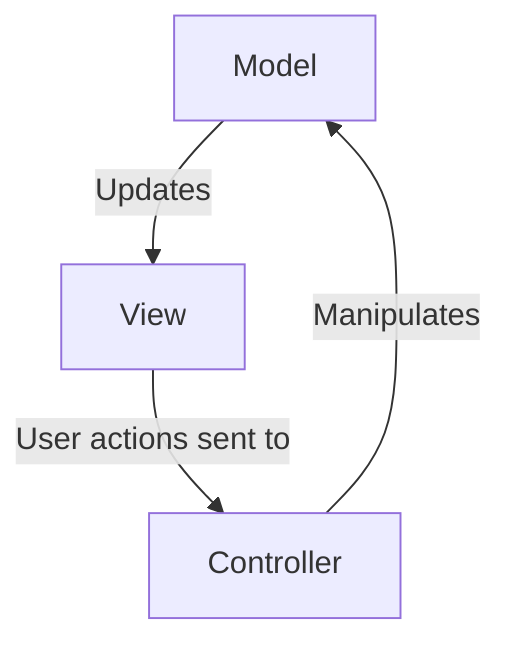
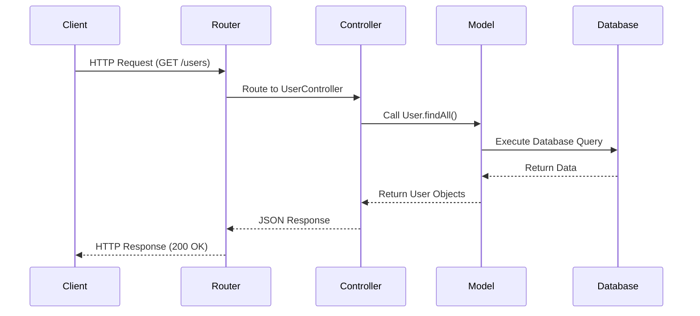
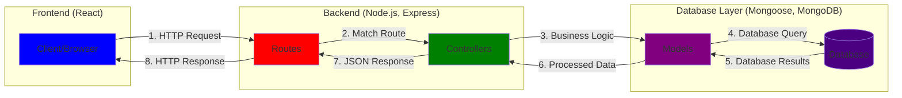

# Software Architecture Pattern

## Model-View-Controller

Our MERN Stack project will be utilising a Model-View-Controller (MVC) architecture. **React** will be used for views, **Express** will be our controller, and **Mongoose** will handle our models and interact with our **MongoDB** database. By utilising the "separation of concerns" of the applications business logic and display, MVC architecture allows for parallel development, and more granular maintenance.

An illustration of a general MVC flow is below:



A slightly more detailed version with respect to web architecture:



The stack flow of our project is:

- Node.js: Provides execution of server-side JavaScript code
- Express.js: Runs on Node.js to handle routing and middleware (Controller)
- Mongoose ODM: Interfaces with MongoDB to manage data models (Model)
- React: Renders the user interface (View/Client layer)

This project specific flow is illustrated below:



We will break down MVC into its components in more detail, and how they're applied in our project below.

---

### Model

The **Model** component of MVC, put simply, handles the data. Whichever database system is chosen in a project handles validation and sanitisation of any and all data associated with the application. In our case, using **Mongoose** to interact with a **MongoDB** noSQL database. Mongoose schemas and models will be used to create and validate object data, which will be accessed by the **Express** controller component, and passed to the **React** view component.

### View

The **View** component of MVC is, drumroll, what the user views! The user interfaces with the application at the view level, and it presents data to the user. Our **React** frontend will render interactive UI components (EG. Movie cards, user profiles, leaderboards.) The view will receive data from the controller and display it in a user-friendly way, whilst also capturing view layer interactions (EG. Listening to a `button` for a `click` event) and to trigger actions in the controller.

### Controller

The **Controller** component of MVC, well, it controls! The controller handles requests and responses made by the user from the view component, interacts and manipulates data from the model component, and responds to the view to display results of logic to the user. **Express** is our controller in this application, and consists of routing, error handling, business logic, and responses. It's the main gear-box of our application, which uses complex functions, authorisation and middleware to provide the building blocks of what is displayed to the user.

The below example represents MVC in action. Our **View** layer (React) displays a form, and sends POST request to our **Controller** (Express backend), which manipulates the **Model** (Mongoose & MongoDB), and returns results to the **View**.

```javascript
app.post("/login", async (request, response) => {
  const { email, password } = request.body;

  // Check if user exists, if not, return error message
  const user = await User.findOne({ email });
  if (!user) {
    return response
      .status(401)
      .json({ error: "No user with this email exists" });
  }

  // If user exists, validate password, if invalid return error message
  const isValid = await user.validatePassword(password);
  if (!isValid) {
    return response.status(401).json({ error: "Invalid password" });
  }

  // Success → 200 OK
  response.status(200).json({
    message: "Login successful!",
    user: {
      name: user.name,
      reelscore: user.reelscore,
    },
  });
});
```
