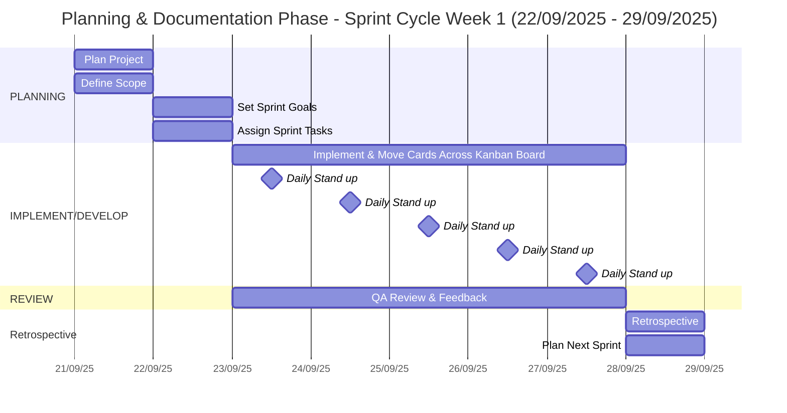

**Example Gantt Timeline of Sprint Cycle 1:**

```mermaid
gantt
title Planning & Documentation Phase - Sprint Cycle Week 1 (22/09/2025 - 29/09/2025)
dateFormat  DD-MM-YYYY
axisFormat  %d/%m/%y

section PLANNING
Plan Project:plan, 21-09-2025, 0.5d
Define Scope:scope, 21-09-2025, 0.5d
Set Sprint Goals:bl-goals, 22-09-2025, 0.5d
Assign Sprint Tasks:sprint1, 22-09-2025, 0.5d

section IMPLEMENT/DEVELOP
Implement & Move Cards Across Kanban Board:implement, 23-09-2025, 5d
Daily Stand up:milestone, stand1, 23-09-2025, 1d
Daily Stand up:milestone, stand2, 24-09-2025, 1d
Daily Stand up:milestone, stand3, 25-09-2025, 1d
Daily Stand up:milestone, stand4, 26-09-2025, 1d
Daily Stand up:milestone, stand5, 27-09-2025, 1d

section REVIEW
QA Review & Feedback:review, 2025-09-23, 5d

section Retrospective
Retrospective:retro, 2025-09-28, 0.5d
Plan Next Sprint:sprint2, 2025-09-28, 0.5d
```
