# DEV1003 Planning & Design Documentation

## Table of Contents

1. [Programming Paradigm](#programming-paradigm)
2. [Software Architecture Pattern](#software-architecture-pattern)
3. [Software Development Methodologies](#software-development-methodologies)
4. [Task Management Methodology](#task-management-methodology)
5. [Client Server Architecture](#client-server-architecture)
6. [Entity Relationship Diagram](#entity-relationship-diagram)
7. [User Stories](#user-stories)
8. [Ethical Web Development Principles](#ethical-web-development-principles)
9. [Wireframes](#wireframes)

## Programming Paradigm

### Hybrid Approach: OOP Backend with Functional Frontend

At this stage of our application's development we are planning to use a hybrid approach of programming paradigms, choosing the most appropriate for different layers of the application:

- **Backend (Node.js, Express, Mongoose):** Object-Oriented Programming
- **Frontend (React):** Functional Programming with Hooks

The backend will define data models (e.g `User`, `Movie`, `Rating`, `Friendship`) using OOP principles to ensure validation and sanitisation, reusability, and maintainability. The frontend will be written with React functional components, where UI elements like **ReelCards**, **Popcorn Meter** and **Leaderboard Tables** are built as discrete functions, with states managed through hooks.

Ideally, custom hooks will be created to interact with data from the database, and render different UI based on conditional logic and user input. This functional programming will complement our OOP backend system, providing a strongly interactive UI, and enabling us to keep our business logic pure and simple.

For the purposes of this assessment, we will provide a thorough explanation of Object-Oriented Programming (OOP) as it is the foundation of our data models and application logic.

---

### Object Oriented Programming

Object Oriented Programming is a paradigm which structures code into objects (or **classes**) that bundle related data (attributes) and behaviours (methods) into modular units, aligning with our application entities, such as a `User` object that stores profile data and methods for authentication, or a `Movie` object which bundles metadata, critical ratings, and relationships to genres and directors.  
OOP promotes modular code organisation, reusability and maintainability through abstraction, encapsulation, inheritance and polymorphism (more on those terms and how they apply to _The Century Screening Room_ below!)

---

### The Four Pillars of OOP

The four key principles of OOP are referred to as _The Four Pillars_. They are a set of rules to follow when creating an application, in order to help write clean, efficient and maintainable codebases. Let's discuss The Four Pillars in detail below.

---

#### Abstraction

Essentially, this is ensuring that overcomplicated details of your code are "hidden away" behind simple interfaces. Abstraction focuses on only exposing essential features, keeping your code DRY and readable. Without abstraction your code can will be full of repeated and complex function code, and with several complicated functions can be difficult to understand.

For example, if you have a coffee making application:

- Processes abstracted from the user in hidden methods:
  - "Boil water"
  - "Measure coffee beans"
  - "Adjust grind setting to coarse"
  - "Grind coffee"
  - "Add boiling water to coffee pot"
  - "Wait five minutes"
  - "Stir coffee"
  - "Wait three minutes"
  - "Press coffee plunger"
- After abstraction, the simple interface becomes:
  - "Make a French Press Coffee"

As a practical coding example, the below is **abstracted** complex logic hidden from the user inside a method:

```js
class CoffeeMaker {
  constructor(type, size) {
    this.type = type;
    this.size = size;
    this.isBrewing = false;
  }

  makeCoffee() {
    // Complex coffee-making logic hidden from the user
    this.boilWater();
    this.grindBeans();
    this.bloomCoffee();
    this.pourWater();
    this.isBrewing = true;
    return "Your coffee is ready!";
  }

  // Private methods (implementation details)
  boilWater() {
    /* complex temperature control logic */
  }
  grindBeans() {
    /* complex grinding settings logic */
  }
  bloomCoffee() {
    /* complex timing and pouring logic */
  }
  pourWater() {
    /* complex water flow control logic */
  }
}
```

Below is the **simple interface** that abstraction creates for the user:

```js
// Simple usage - the user just calls makeCoffee()
const myCoffee = new CoffeeMaker("French Press", "Large");
myCoffee.makeCoffee(); // All complexity hidden!
```

Abstraction is the design pattern, not the end result. Meaning that the class design _is_ the abstraction that hides complexity from the user.

In our project:

- The backend of our application will expose only high level methods (EG. `registerUser()` or `loginUser()`) while hiding security measures such as password hashing, validation or session (auth-token) logic.
- The frontend of our application will trigger a `markAsWatched()` call, while the backend handles updating of associated data (EG. `User` `ReelProgress` records are recalculated, and the Leaderboard is adjusted)

---

#### Encapsulation

Encapsulation bundles data and methods which operate on the data within a single class or object, while restricting access to some of the objects components. This is achieved through the implementation of private properties and other modifiers.

**_Diagram Figure 1: Encapsulation in our application (private user data)_**

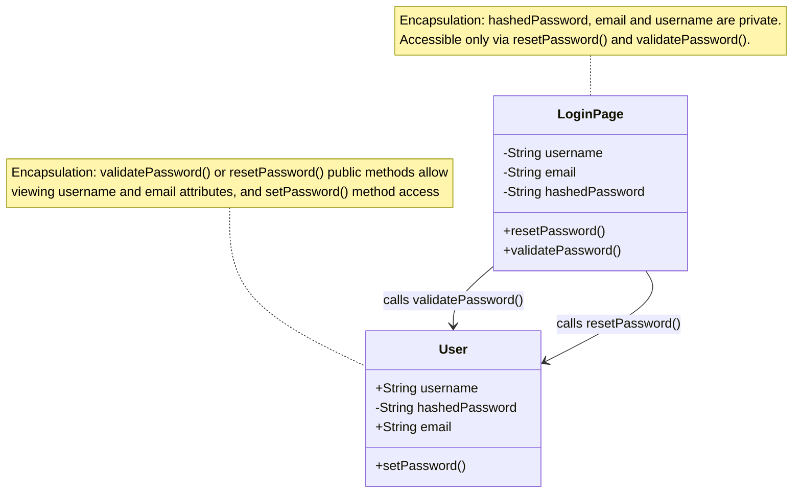

An example of this is a user object which has a password as an attribute:

- A user must enter a password when registering or logging in
- The password is interacted with but **should never be stored as plain text, or directly accessible**
- Encapsulation ensures that password hashing occurs _within_ the `User` class, while only exposing safe methods such as `validatePassword()`

A practical coding example is below:

**Without Encapsulation:**

```js
// Dangerous - password exposed
user.password = "plaintext123";
console.log(user.password); // Anyone can read it!
```

**With Encapsulation:**

```js
const UserSchema = new mongoose.Schema({
  username: { type: String, required: true, unique: true },
  email: { type: String, required: true, unique: true },
  passwordHash: { type: String, required: true },
});

// Encapsulation through schema methods
UserSchema.methods.setPassword = async function (plainTextPassword) {
  this.passwordHash = await bcrypt.hash(plainTextPassword, 12); // 12 salt rounds
};

UserSchema.methods.validatePassword = async function (attempt) {
  return await bcrypt.compare(attempt, this.passwordHash);
};
```

Encapsulation bundles data and methods within classes or schemas, and protects sensitive data through access and modification controls.

In our project:

- The `User` model will encapsulate passwords by storing them as hashed versions, and exposing only safe high level methods (EG. `validatePassword()`)
- Ratings are encapsulated within a `Rating` object, which ensures they are always linked with the related `User` and `Movie`.

---

#### Inheritance

Inheritance is the passing of properties and methods from an existing _parent_ object to a new related _child_ object. This is helpful for almost all programming projects, as it promotes code re-use, keeping codeblocks DRY, and forms logical hierarchy for related objects.

**_Diagram Figure 2: Class based inheritance_**

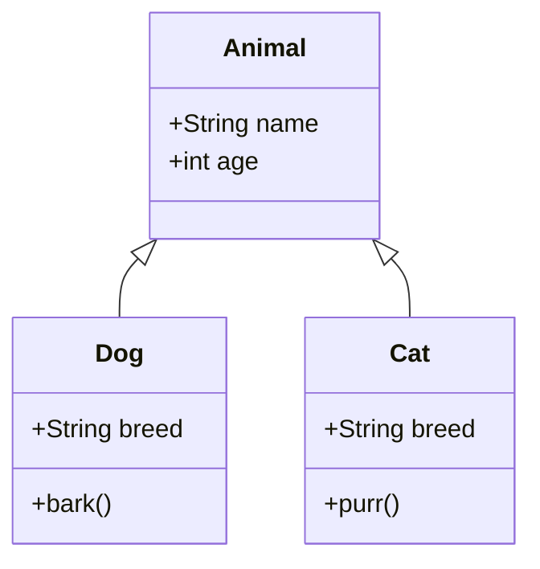


As an example, let's think use these classes: `Animal`, `Cat` and `Dog`.

- `Animal` is a parent class, as both `Dog` and `Cat` are animals.
- `Animal` has the properties: `name` and `age`
- `Dog` is an animal, so it inherits the properties `name` and `age` from the `Animal` object, but has the new properties `breed` and a new method `bark()`
- `Cat` is an animal, so it inherits the properties `name` and `age` from the `Animal` object, but has the new properties `breed` and `purr()`

A practical coding example is below:

```js
class Animal {
  constructor(name, age) {
    this.name = name;
    this.age = age;
  }
}

class Dog extends Animal {
  constructor(name, age, breed) {
    super(name, age); // Inherit from Animal
    this.breed = breed;
  }

  bark() {
    return "Woof!";
  }
}

class Cat extends Animal {
  constructor(name, age, breed) {
    super(name, age); // Inherit from Animal
    this.breed = breed;
  }

  purr() {
    return "Purrrr...";
  }
}

// Usage
const myDog = new Dog("Rex", 3, "Labrador");
console.log(myDog.name); // "Rex" (inherited from Animal)
console.log(myDog.bark()); // "Woof!" (Dog's own method)
const myCat = new Cat("Fluffy", 7, "Devon Rex");
console.log(myCat.age); // 7 (inherited from Animal)
console.log(myCat.purr()); // "Purrrr..." (Cat's own method)
```

Inheritance allows classes to share attributes, properties and methods from their parent class.

In our project:

- A base `User` class could provide attributes (`username`, `email`, `password`) while child classes like `Admin` or `StandardUser` add role specific methods (EG. `viewAll()` methods for admins to see bulk data, and `removeUser()` to ban users)
- `List` objects (EG. _The Reel Canon_ vs _Custom Lists_) can inherit common behaviours such as adding/removing movies, with different scope (fixed canon list vs user-generated and controlled custom lists)

Below is an example of Mongoose schema inheritance for `List` objects in _The Century Screening Room_:

```js
// Base schema for all lists
const ListSchema = new mongoose.Schema(
  {
    name: { type: String, required: true },
    movies: [{ type: mongoose.Types.ObjectId, ref: "Movie" }],
    createdBy: { type: mongoose.Types.ObjectId, ref: "User" },
  },
  { discriminatorKey: "listType", timestamps: true }
);

// Base model
const List = mongoose.model("List", ListSchema);

// Inherited model: The Reel Canon (fixed)
const ReelCanon = List.discriminator(
  "ReelCanon",
  new mongoose.Schema({
    isLocked: { type: Boolean, default: true }, // cannot be edited by users
  })
);

// Inherited model: Custom List (user-generated)
const CustomList = List.discriminator(
  "CustomList",
  new mongoose.Schema({
    description: String,
    isPublic: { type: Boolean, default: false },
  })
);
```

---

#### Polymorphism

Polymorphism is an incredibly versatile tool in OOP. It allows objects of different classes to be treated as one larger class, with the same method behaving differently depending on the object which has called it.

To follow on from our animal example:

- An `Animal` object has the method `speak()`
- A `Dog` object returns "Woof!" when speak is called on it
- A `Cat` object returns "Meow!" when speak is called on it

What this looks like in code:

```javascript
class Animal {
  speak() {
    return "Some animal sound";
  }
}

class Dog extends Animal {
  speak() {
    return "Woof!";
  }
}

class Cat extends Animal {
  speak() {
    return "Meow!";
  }
}

// Polymorphism in action - create a new Dog and Cat object
const animals = [new Dog(), new Cat()];

// Loop through the array of new objects, and call the speak() method for each
animals.forEach((animal) => console.log(animal.speak())); // Output: "Woof!" then "Meow!" - same method, different behaviour
```

Polymorphism lets different classes implement the same methods but behave differently.

In our project:

- A `FormInput` React component can render differently depending on whether it's a login field, a genre selector, or a friend search field, but all share a single interface
- A `ReelCard` component in the Reel Canon can represent the same movie object in multiple states. For example, movie cards will have a **watched** and **unwatched** state, with a change in rendered display based on these states. Watched movies will provide users with glow effects and the movie poster, whilst unwatched movies will be rendered as cards with Title, Year and Genre details. Both will respond to `onClick` and `onHover`, but will behave differently depending on the **watched** or **unwatched** state.

---

### Conclusion

Combined with our functional React frontend, an OOP backend provides a robust scalable, secure, and versatile foundation. Abstraction allows users to interface with methods simply, encapsulation ensures access to data related to objects is secure and controlled, inheritance keeps code DRY through reuse, and polymorphism enables flexible methods which adapt as needed. Together, these Four Pillars will shape our backend design and ensure that our finished application is delivered to a high standard.

---

---

## Software Architecture Pattern

### Model-View-Controller

Our MERN Stack project will be utilising a Model-View-Controller (MVC) architecture. `React` will be used for views, `Express` will be our controller, and `Mongoose` will handle our models and interact with our `MongoDB` database. By utilising the "separation of concerns" of the applications business logic and display, MVC architecture allows for parallel development, and more granular maintenance.

**_Diagram Figure 1: An illustration of Model, View, Controller architecture pattern_**

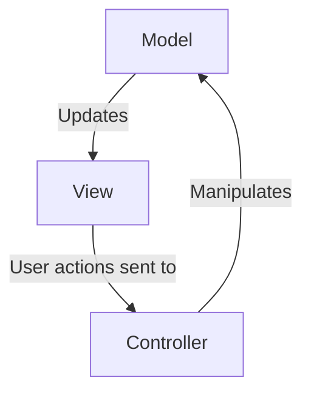

In regards to web applications, there is a little further detail we can delve into. The diagram below illustrates further detail!

**_Diagram Figure 2: Model, View, Controller in web applications_**

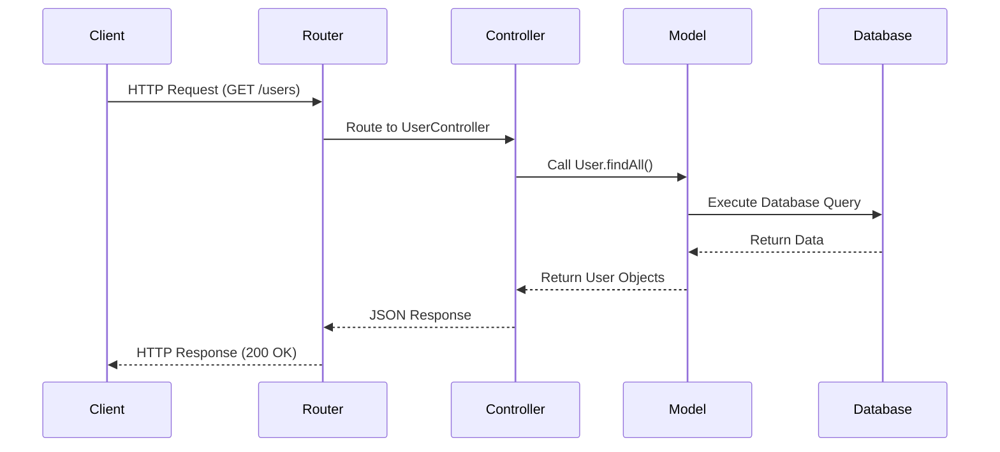

The stack flow of our project is:

- **Node.js:** Provides execution of server-side JavaScript code
- **Express.js:** Runs on Node.js to handle routing and middleware (Controller)
- **Mongoose ODM:** Interfaces with MongoDB to manage data models (Model)
- **React:** Renders the user interface (View/Client layer)

**_Diagram Figure 3: Project specific Model, View, Controller flow_**

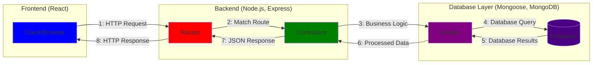

We will break down MVC into its components in more detail, and how they're applied in our project below.

---

#### Model

The **Model** component of MVC, put simply, handles the data. Whichever database system is chosen in a project handles validation and sanitisation of any and all data associated with the application. In our case, using **Mongoose** to interact with a **MongoDB** noSQL database. Mongoose schemas and models will be used to create and validate object data, which will be accessed by the **Express** controller component, and passed to the **React** view component.

#### View

The **View** component of MVC is, drumroll, what the user views! The user interfaces with the application at the view level, and it presents data to the user. Our **React** frontend will render interactive UI components (EG. Movie cards, user profiles, leaderboards.) The view will receive data from the controller and display it in a user-friendly way, whilst also capturing view layer interactions (EG. Listening to a `button` for a `click` event) and to trigger actions in the controller.

#### Controller

The **Controller** component of MVC, well, it controls! The controller handles requests and responses made by the user from the view component, interacts and manipulates data from the model component, and responds to the view to display results of logic to the user. **Express** is our controller in this application, and consists of routing, error handling, business logic, and responses. It's the main gear-box of our application, which uses complex functions, authorisation and middleware to provide the building blocks of what is displayed to the user.

The below example represents MVC in action. Our **View** layer (React) displays a form, and sends POST request to our **Controller** (Express backend), which manipulates the **Model** (Mongoose & MongoDB), and returns results to the **View**.

```javascript
app.post("/login", async (request, response) => {
  const { email, password } = request.body;

  // Check if user exists, if not, return error message
  const user = await User.findOne({ email });
  if (!user) {
    return response
      .status(401)
      .json({ error: "No user with this email exists" });
  }

  // If user exists, validate password, if invalid return error message
  const isValid = await user.validatePassword(password);
  if (!isValid) {
    return response.status(401).json({ error: "Invalid password" });
  }

  // Success → 200 OK
  response.status(200).json({
    message: "Login successful!",
    user: {
      name: user.name,
      reelscore: user.reelscore,
    },
  });
});
```

---

---

## Software Development Methodologies

This section explains the Software Development Methodologies and how we plan to implement them in our MERN Full-Stack project: **The Century Screening Room**.

During the planning phase, we considered our project scope, team size and the need for flexibility across the lifecycle. Although we looked at Scrum, we decided that the dedicated roles (eg. Product Owner/Scrum Master) wasn't practical for a team of our size. Instead, we decided responsibilities are shared where every team member contributes to backlog refinement, stand-ups, sprint planning and retrospectives.

By combining both Agile for project management with Kanban for task management, this provided us with a balance of structure and flexibility. Agile guides our sprints and retrospectives, while Kanban provides the visual workflow framework that supports those Agile practices [(Radigan D, 2025)](https://www.atlassian.com/agile/kanban).

Together, these methodologies give us a structured yet adaptable workflow that can evolve across all three phases of the project lifecycle.

---

### Agile Project Management Methodology

Agile is an iterative and incremental project management methodology that focuses on delivering value in short, manageable cycles rather than through a single, rigid plan. Its core philosophy emphasises adaptability, collaboration, transparency, and continuous improvement [(Drumond C, 2025)](https://www.atlassian.com/agile/project-management).

Instead of completing all planning upfront, Agile encourages teams to work in small sprints, gather feedback, and refine their approach as requirements evolve [(Atlassian, 2025)](https://www.atlassian.com/agile).

By prioritising working outcomes over extensive documentation and responding to change over following a fixed plan, Agile enables teams to stay flexible and maintain momentum even in complex or uncertain projects. Practices such as daily stand-ups, sprint reviews, and retrospectives ensure constant communication, while backlog refinement and prioritisation help keep the team aligned on the most valuable tasks [(Atlassian, 2025)](https://www.atlassian.com/agile).

**For our MERN full-stack project, Agile is particularly effective because it supports:**

- A small team structure (group of 3) where roles are shared and collaboration is key.
- An iterative workflow, where we can start with core MVP features and expand in later phases.
- A focus on continuous feedback, both internally (retrospectives) and externally (future user testing).
- Adaptability as requirements shift across back-end and front-end phases.

---

**_Diagram Figure 1: Agile Methodology Cycle (iteration, feedback, improvement)_**

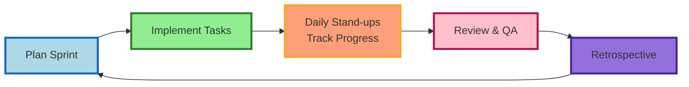

---

**_Diagram Figure 2: Agile & Kanban Adaptation Example Across Phases 1 (Planning & Design), 2 (Back-End Development) & 3 (Front-End Development)_**

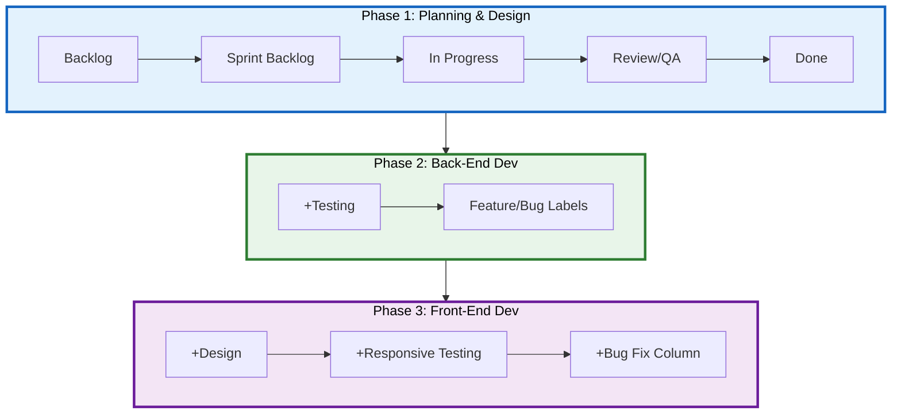

---

### Agile Core Principles We Apply

- **Short development cycles (sprints):**
  Work is delivered in small, manageable increments each week, allowing us to demonstrate progress regularly and adjust quickly if priorities shift.

- **Continuous feedback and reflection:**
  Daily stand-ups, sprint reviews, and retrospectives create a loop of constant improvement, ensuring issues are caught early and lessons are applied in the next cycle.

- **Adaptability to change:**
  Agile values flexibility over rigid planning, which means we can respond to evolving requirements, feedback, or blockers without derailing the entire project.

- **Collaboration and transparency:**
  Open communication and shared visibility (via Trello, Slack and GitHub) keep all team members aligned, accountable and empowered to contribute equally.

[(Atlassian, 2025)](https://www.atlassian.com/agile); [(Drumond C, 2025)](https://www.atlassian.com/agile/project-management)

---

#### Implementation of Agile Practices

Working in an Agile approach helps us maintain progress while adapting to changes. It fits our small team and evolving scope by enabling short feedback loops and continuous improvement.
[(Drumond C, 2025)](https://www.atlassian.com/agile/project-management)

Implementation plan of Agile practices include:

| **Agile Practice**           | **Implementation Description**                                                                                                                                                                                      |
| ---------------------------- | ------------------------------------------------------------------------------------------------------------------------------------------------------------------------------------------------------------------- |
| **Sprints**                  | Weekly cycles delivering incremental outcomes aligned with MVP requirements.                                                                                                                                        |
| **Daily Stand-ups (Slack)**  | Quick posts covering yesterday’s work, today’s plan, and any blockers. High-priority blockers are flagged in Trello and raised in stand-ups to highlight risks early, allowing the team to re-prioritise if needed. |
| **Sprint Planning**          | At the start of each sprint, we estimate workload, prioritise tasks, assign ownership, and define acceptance criteria.                                                                                              |
| **Retrospectives**           | End-of-sprint reviews to reflect on what worked, challenges faced, and what to improve for the next cycle.                                                                                                          |
| **Definition of Done (DoD)** | Each user story/task card must include acceptance criteria and be peer-reviewed before moving to “Done”. Relevant documentation and tests are updated.                                                              |
| **Task Prioritisation**      | Dependencies and MVP-aligned tasks are prioritised and addressed first to ensure critical path progress.                                                                                                            |
| **Backlog Hygiene**          | Regular refinement of epics and stories keeps the scope realistic and focused.                                                                                                                                      |
| **Pipeline Management**      | Continuous review of progress against roadmap projections ensures the team stays on track with overall project milestones.                                                                                          |
| **Continuous Integration**   | Our GitHub workflow (feature branches, PRs, peer reviews, CI checks) supports Agile principles of continuous delivery and code quality.                                                                             |

---

**_Diagram Figure 3: Continuous Integration Flow_**

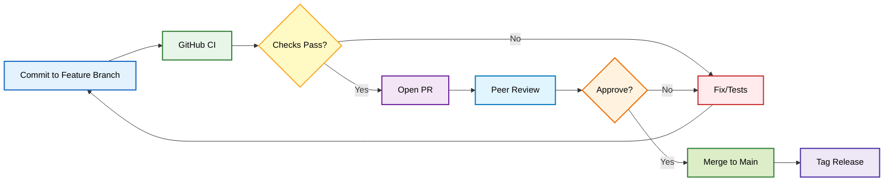

### How Agile and Kanban Integrate

- Agile gives us the cadence (sprints, planning, retrospectives). [(Radigan D, 2025)](https://www.atlassian.com/agile/kanban)

- Kanban (in Trello) provides the visual flow to execute those practices day-to-day. [(MiroBlog, 2025)](https://miro.com/blog/scrum-kanban-boards-differences)

**_Diagram Figure 4: Agile & Kanban Methodology Core Principles_**

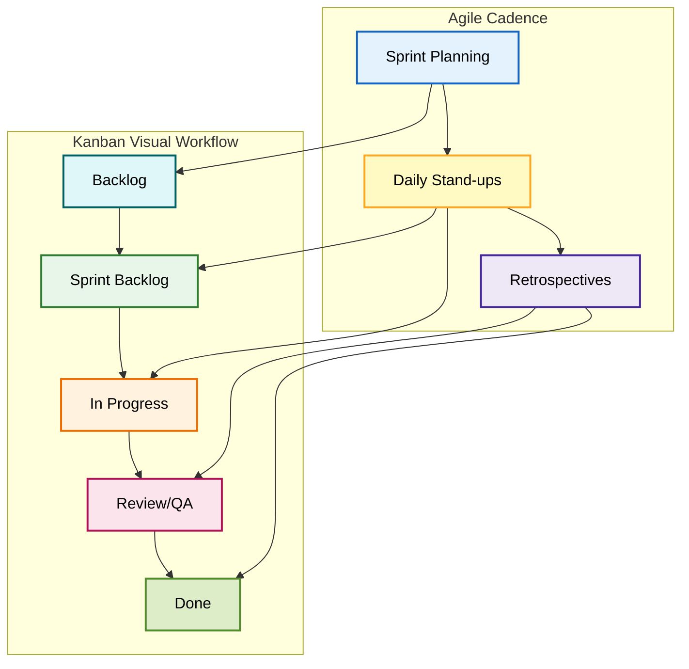

---

### Agile Application Across Phases

We adopted Agile as our overarching methodology because it was suitable for our team size working on a full-stack project that would require flexibility and regular adjustments.

**_Diagram Figure 5: Gantt Project Roadmap - Phases 1, 2 & 3_**

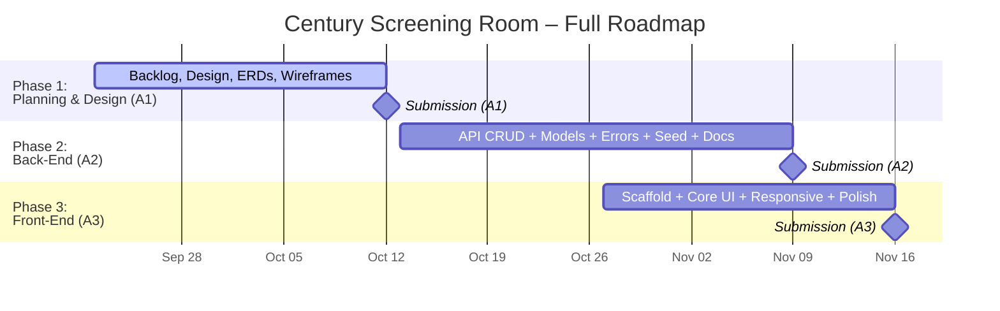

---

#### Phase 1 (Planning, Design and Documentation)

- **Sprint goals:** Software architecture and paradigms, methodology, ERDs, wireframes, initial backlog and Definition of Done (DoD).
- **Retrospective focus:** clarity of scope, rubric alignment, task progress update on team alignments, estimation to manage tasks/workload/prioritisation and timeline projections.

**_Diagram Figure 6: Gantt Project Roadmap - Phase 1 Planning_**

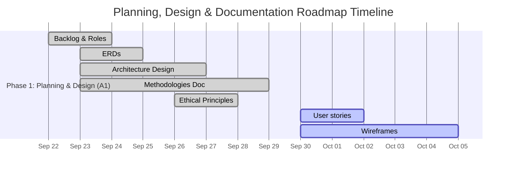

---

#### Phase 2 (Back-End Development)

- **Sprint goals:** CRUD endpoints, validation, error handling, seed data, API docs.
- **Retrospective focus:** code quality, debugging and testing coverage, PR review quality, CI checks.

**_Diagram Figure 7: Gantt Project Roadmap - Phase 2 Back-End Development_**

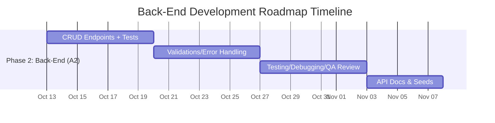

---

#### Phase 3 (Front-End Development)

- **Sprint goals:** UI/UX components, state/data flows, ensure responsiveness and accessible UI design
- **Retrospective focus:** usability feedback, user testing, integration issues, ensure responsiveness and accessibility, polish.
- In Phase 3, we could plan to extend Agile feedback loops beyond retrospectives by incorporating user testing sessions, feeding these insights back into backlog refinement

**_Diagram Figure 8: Gantt Project Roadmap - Phase 3 Front-End Development_**

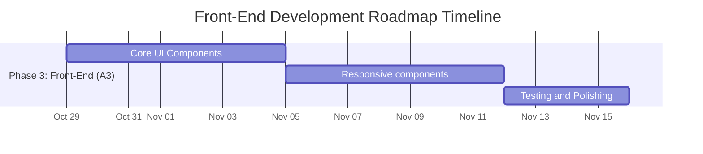

---

### Examples of Agile in Practice

#### Phase 1 – Planning, Design & Documentation

##### Example 1: Sprint Planning

1. Define sprint goals aligned with rubric MVPs.
2. Select tasks cards/user stories into sprint and add acceptance criteria and ownership.
3. Run daily Slack stand-ups. Example of our stand-up format:
   - Yesterday’s work and time spent
   - Today’s plan
   - Completion % toward phase goal
   - Low vs high-priority blockers
4. Closed sprint with a retrospective and adjusted for the next cycle.
5. Repeated the cycle of planning → implementing → reviewing → reflecting.

**_Diagram Figure 9: Sprint Planning - Sprint Cycle Week_**

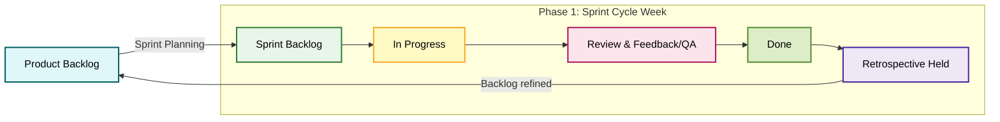

---

##### Example 2: Wireframes Designing

**Task:** Create wireframes for the Reel Canon movie list page (for desktop, tablet, and mobile views).

- **Sprint Planning:**

  - In our sprint planning session, we created a backlog task card in Trello: “Design ReelCanon Wireframes (Desktop + Tablet + Mobile).”
  - The card included acceptance criteria
  - Task assigned to a team member with a checklist for each device layout.
  - Outcome: Drafts in Figma → peer feedback → export PNGs → push to GitHub.

- **Kanban Workflow:**

  - Card moved from Backlog → Sprint Backlog → In Progress during Sprint 2.
  - Daily Slack stand-up example: _“Yesterday I sketched the mobile layout; today I’ll start on tablet responsive design; no blockers so far.”_

- **Review and Feedback (QA):**

  - Once initial drafts were done in Figma, the card was moved to Review column.
  - Other team members provided peer feedback (eg. Make hover effect on desktop and consider alternative options on Tablet and Mobile as 'hover' may not work on these devices).

- **Definition of Done (DoD):**

  - Meeting held to collaborate and reflect and provide feedback for adjustments
  - Final wireframes were exported and uploaded to GitHub repo.
  - The card was moved to Done, with the acceptance criteria checked off.

- **Retrospective:**
  - In the sprint retrospective, we noted that defining acceptance criteria at the start made peer review smoother and reduced rework.

**_Diagram Figure 10: Agile & Kanban Workflow for Wireframe Design (Planning Phase)_**

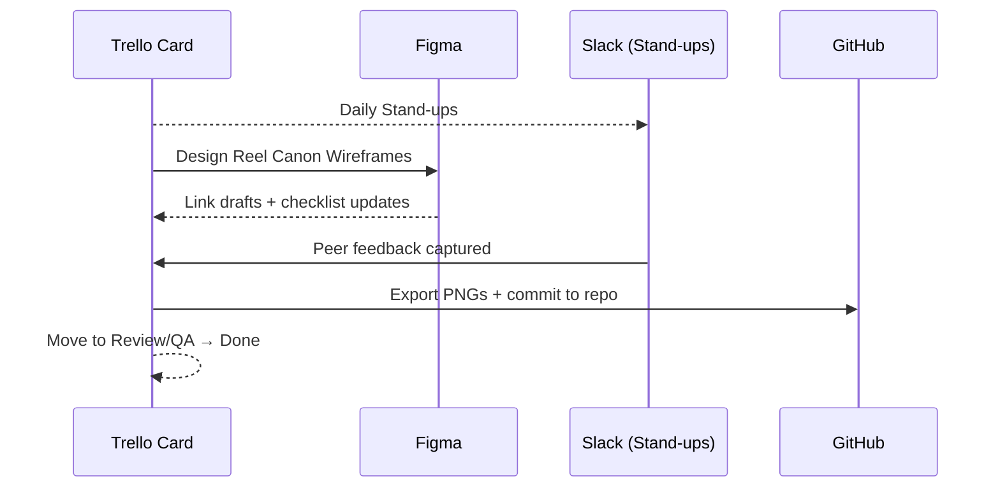

---

#### Phase 2 – Back-End Development

##### Example 3: CRUD Endpoint Development

**Task:** Implement the CRUD Route endpoints

- **Sprint Planning:**

  - The team will set sprint goals for full CRUD functionality in a controller

- **Kanban Workflow:**

  - The card moved from Backlog → Sprint Backlog → In Progress.
  - Daily Slack stand-up update example: “Yesterday I scaffolded the controller and model, today I’ll add validation logic and write initial tests. No blockers so far.”

- **Review and Feedback (QA):**

  - Once the code is pushed to a feature branch, a Pull Request is opened to review on GitHub
  - Peer review checked for clarity, naming conventions and testing coverage

- **Definition of Done (DoD):**

  - Endpoint passed local testing via Insomnia/Bruno
  - PR approved and merged into the main branch
  - Update API documentation with example request/response
  - Card moved to Done after all acceptance criteria met

- **Retrospective:**
  - Once code is working, we will review and apply DRY principles
  - We will examine what can be re-used in other CRUD functionality to streamline development

**_Diagram Figure 11: Agile & Kanban Workflow for CRUD Endpoint Development (Back-End Phase)_**

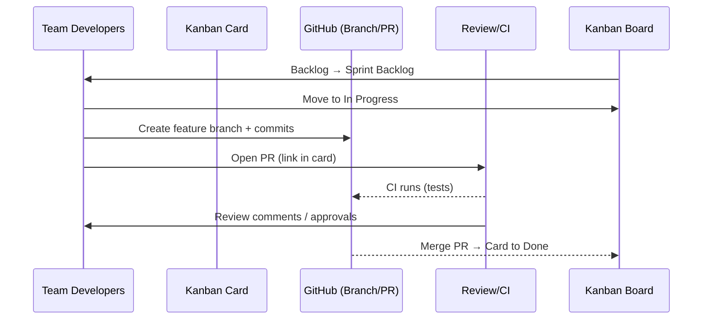

---

#### Phase 3 – Front-End Development

##### Example 4: UI/UX Components Development in Practice

**Task:** Build the “Movie Card” component for displaying movies in the Reel Canon list.

- **Sprint Planning:**
  - Create Trello Card: “Build Movie Card Component (responsive)”
  - Tasks examples:
    - Component creation
    - CSS Styling
    - Unit testing
  - Acceptance criteria example:
    - Desktop: grid view with poster images, 'hover effect' shows description
    - Tablet: vertical scrolling grid layout with 'tap to expand' details
    - Mobile: compact cards with 'tap to reveal' overlays for info and rating
- **Kanban Workflow:**
  - The card moved from Backlog → Sprint Backlog → In Progress.
  - Daily Slack stand-up update example: “Yesterday I set up the component scaffold, today I’ll integrate test for hover/tap states. One blocker is deciding final font sizing for mobile.”
- **Review and Feedback (QA):**
  - Commit code to a feature branch, then open PR for review.
  - Peer feedback on styling consistency and accessibility (eg. ARIA labels for screen readers).
  - Make any necessary adjustments before merging.
- **Definition of Done (DoD):**
  - Component tested locally in dev build across desktop, tablet, and mobile breakpoints.
  - Peer-reviewed and merged into main.
  - Wireframes updated to reflect final UI alignment.
- **Retrospective:**
  - Future Example: Discussion about breakpoints criteria to adopt for future responsive components.

**_Diagram Figure 12: Agile & Kanban Flow for Front-End Component Development (Movie Card Example)_**

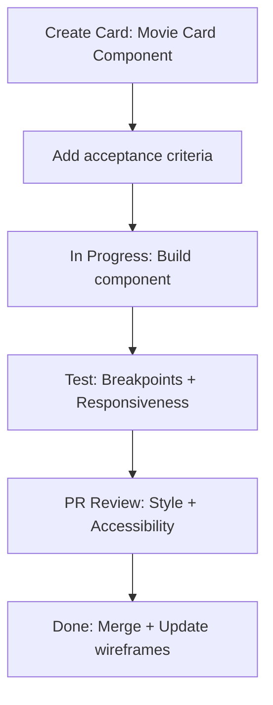

---

### Tools and Technologies

| Tools/Platforms                     | Source                                                                                   | Purpose                                                                                                                                                                                                                |
| ----------------------------------- | ---------------------------------------------------------------------------------------- | ---------------------------------------------------------------------------------------------------------------------------------------------------------------------------------------------------------------------- |
| **Kanban Board**                    | [Trello](https://trello.com/)                                                            | Kanban board for task management and visualisation of workflow                                                                                                                                                         |
| **Communication**                   | [Slack](https://slack.com/)                                                              | Communication for team collaboration, quick communications, daily stand-ups and retrospectives                                                                                                                         |
| **Documentation & Version Control** | [GitHub Repository](https://github.com/CoderAcademy-DEV-MERN-Group/DEV1003-Assessment01) | Central repository for documentation, codebase and version control. Working off individual feature branches and Pull Requests to review documentation and codebase. Tracked changes and accessible for our whole team. |
| **Design/Wireframes**               | [Figma](https://figma.com/)                                                              | Designing wireframes and UX/UI design for across different devices (responsive for Mobile + Tablet + Desktop)                                                                                                          |
| **API Testing**                     | [Insomnia](https://insomnia.rest/) / [Bruno](https://www.usebruno.com/)                  | API Endpoint Testing                                                                                                                                                                                                   |

### References - Software Development Methodologies

| References                                                                                                                                                                                   |
| -------------------------------------------------------------------------------------------------------------------------------------------------------------------------------------------- |
| Atlassian (2025). _What is Agile?_. Atlassian. Available at: <https://www.atlassian.com/agile> (Accessed 23 Sep. 2025).                                                                      |
| Drumond, C. (2025). _What is Agile Project Management?_. Atlassian. Available at: <https://www.atlassian.com/agile/project-management> (Accessed 23 Sep. 2025).                              |
| Radigan, D. (2025). _Kanban A Brief Introduction_. Atlassian. Available at: <https://www.atlassian.com/agile/kanban> (Accessed 23 Sep. 2025).                                                |
| MiroBlog. (2025). _Kanban vs. Scrum boards: 11 differences to help you choose the best tool_. Available at: <https://miro.com/blog/scrum-kanban-boards-differences> (Accessed 23 Sep. 2025). |

---

---

## Task Management Methodology

We chose Kanban as our Task management Methodology as it provides a visual system for tracking progress, limiting work in progress (WIP), and maintaining a continuous delivery flow. Kanban helps teams visualise workflow, manage priorities, and adapt as requirements change. Work in progress (WIP) limits help maintain focus and prevent overload, while visible progress supports collaboration and shared responsibility across all project phases [(Radigan D, 2025)](https://www.atlassian.com/agile/kanban).

This makes it especially effective for our small team to stay organised and aligned while working in a continuous flow.

### Kanban Methodology Core Principles

- **Visualise the workflow:** Tasks are represented as cards are moved across columns as the status progresses. Kanban board columns make progress visible to all team members at a glance.
- **Limit WIP:** Apply work in progress (WIP) to prevent overload and highlight bottlenecks (eg. < 3 cards per person)
- **Continuous improvement:** Evolve the board as project needs shift.
- **Shared ownership:** No single leader - all team members manage the board.

[(Atlassian, 2025)](https://www.atlassian.com/agile/project-management/kanban-principles)

---

### Implementation of Kanban in Practice

#### 1. Agile Integration with Kanban

Our workflow integrates Agile as the overarching Project Management Methodology and Kanban as the Task Management Methodology. Kanban provides the visual structure that makes our Agile process tangible. Together, they provide a balance of structure with adaptability and provide our team with a clear framework for iterative planning, collaboration and visual task tracking while supporting feedback-driven iteration and continuous improvement [(Atlassian, 2025)](https://www.atlassian.com/agile).

Because our project is being completed within a learning environment with assessment timelines, we adopted some Scrum practices, such as sprint planning, daily stand-ups and retrospectives to create a time boxed rhythm and maintain accountability across deliverables. These activities support communication, shared ownership and reflection while keeping our progress aligned with deadlines [(Rehkopf M, 2025)](https://www.atlassian.com/agile/kanban/kanban-vs-scrum). This combined approach aligns with guidance that Agile principles can be applied through various frameworks [(Atlassian, 2025)](https://www.atlassian.com/agile).

**_Diagram Figure 1: Kanban Workflow in Practice_**

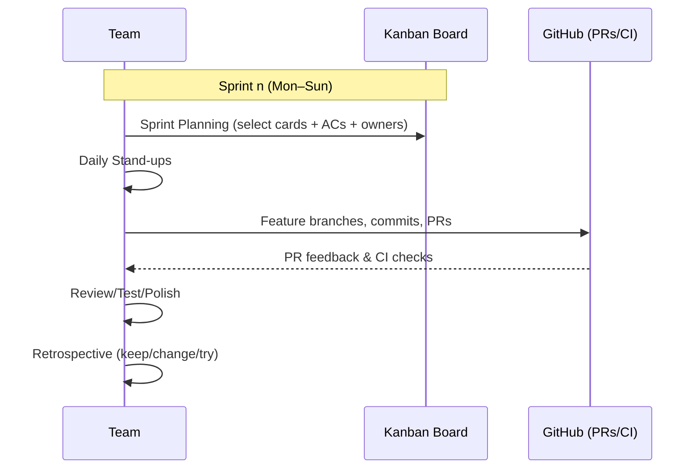

---

#### 2. Kanban Board

We implement Kanban practices using a **Kanban Board** via Trello, to help us manage tasks represented as cards which move through different stages of development progress. This helps us to monitor progress through clearly defined stages represented as columns on a Kanban Board and maintain shared transparency and accountability.

We created the following columns to represent each stage of the task status for Phase 1 - Planning, Design and Documentation:

- **Backlog** – List of tasks/user stories/ideas
- **Sprint Backlog (To Do)** – Tasks planned for the current sprint
- **In Progress** – Active tasks being worked on (WIP limits applied)
- **Review and Feedback (QA)** – Peer review, feedback and testing
- **Done** – Reviewed and completed tasks (kept visible for accountability), linked and pushed to GitHub central repository for version control.

**_Diagram Figure 2: Trello Kanban Board Structure (Phase 1 Baseline)_**

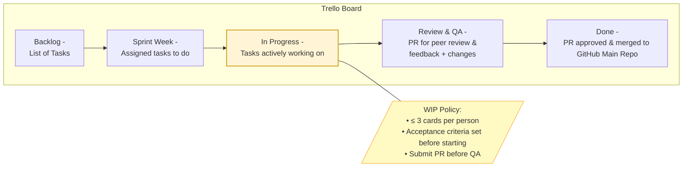

---

#### 3. Cards Breakdown (MVP)

- **Title:** user story or task title description
- **Description:** concise scope and context
- **Acceptance criteria:** reviewable/testable bullet points
- **Labels:** priority (High/Med/Low) + type (eg feature/bug/design/development/testing etc.)
- **Checklist:** subtasks and rubric alignment check off
- **Owner(s):** assigned team member
- **Attachments/links:** Resources eg. Rubric/Figma/GitHub/PR/Insomnia/Bruno

**_Diagram Figure 16: Kanban Task Card Structure (MVP Breakdown)_**

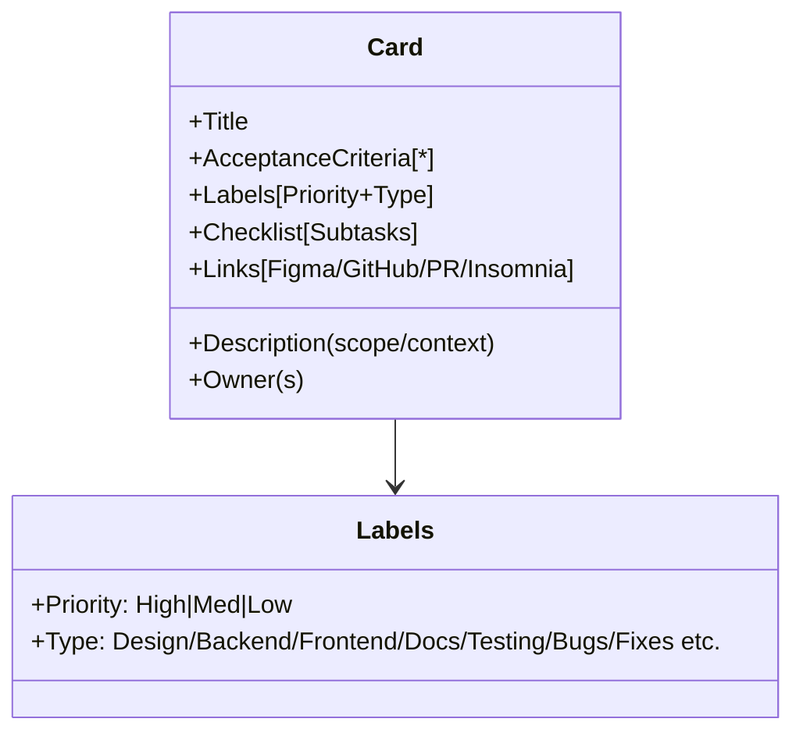

---

As we approach our daily work and assigned tasks, we kept each other up to date via daily stand-ups and weekly retrospectives, to discuss progress and any blockers.

- **Sprint Planning:** Tasks are pulled from Backlog → Sprint Backlog during planning meetings.
- **Daily stand-ups:** Discuss blockers and updates using card statuses on Slack.
- **Retrospectives:** Review WIP limits and productivity and refine Trello columns or other requirements as needed.

**_Diagram Figure 3: Kanban Flow Integrated with Agile Sprint Practices_**

```mermaid
flowchart TB
    A[Backlog] --> B[Sprint Planning]
    B --> C[Sprint Backlog]
    C --> D{Kanban Flow}
    D -->|In Progress| E[Daily Stand-ups<br/>Identify blockers]
    D -->|Review/QA| F[Peer Review + Feedback<br/>Meets Acceptance Criteria]
    F -->|Meets Definition of Done?| G[Done<br/>Linked to GitHub]
    F -->|Changes requested| C
    G --> H[Review/Test]
    H --> I[Retrospective]
    I --> A
```

---

### Kanban Implementation Across Project Phases

We plan to adapt our Kanban board structure to suit the different phases of our project considering the specific needs and workflows of each phase. This may include future integration such as GitHub Projects to support visual cues such as metrics, labels, tag releases, milestones, swimlanes and additional columns for Kanban board to better represent the unique tasks and processes involved in each phase.

For example, during development and implementation phases, additional columns like Testing/Debugging, Deployment/CI may be added. Labels (High/Medium/Low), swimlanes and issues/actions could be used to help us to visually identify and manage priorities, blockers, and dependencies. We will apply Agile practices to make adjustments as needed to ensure our approach remains effective and aligned with our project goals.

Below are some **examples** of how we use Kanban and how we may adapt our Kanban Board and for each phase:

**Phase 1 - Planning, Design and Documentation:**

- **What:** Manage documentation tasks such as documentation for programming paradigm, software architecture pattern and design, ERDs, wireframes and project and task management methodologies from drafts to polished versions.
- **How:** “Design Wireframes” card included acceptance criteria, linked Figma files, and followed the full flow Backlog → In Progress → QA → Done as reflected in the diagrams 2 and 3 mentioned above. Flow metrics can be visualised via GitHub tools such as timelines and PR reviews to track review actions and completion.

**Phase 2 - Back-End Development:**

- **What:** Add Testing, Debugging, Deployment and CI related columns/labels and Tasks cards/user stories for endpoints, schemas and controllers and using labels to distinguish attributes such as bug/feature, priorities, blockers etc.
- **How:** “Implement Express Controllers” tracked PRs in GitHub and Insomnia test links. Labels will be used for visual cue such as marking priorities, feature, bug, testing etc.

**Phase 3 - Front-End Development:**

- **What:** Add Design swimlane and Bug Fix column such as for tasks cards/user stories for UI/UX components, accessibility, responsiveness and integration.
- **How:** “Build Leaderboard Component” card includes Figma references, acceptance criteria, and GitHub commits help us to track and visualise any version control changes.

---

#### Scenario Example - Phase 1: Planning, Designing and Documentation

**Example Task:** Wireframes Design

| **Column / Stage**         | **Description**                                                                                                                                                                                                              |
| -------------------------- | ---------------------------------------------------------------------------------------------------------------------------------------------------------------------------------------------------------------------------- |
| **Backlog**                | Planning discussions for project design and component features for the app idea and vision, including component criteria for pages such as User Profile, Leaderboard, Reel Canon, Search/Filter box, and Grid Cards.         |
| **Sprint Backlog**         | Task card created for _“Design Wireframes for The Century Screening Room Project”_ and assigned to a team member with acceptance criteria defined.                                                                           |
| **In Progress**            | Task card is moved into _In Progress_ once work has begun.                                                                                                                                                                   |
| **Review / Feedback (QA)** | Feedback provided through Slack messages, Zoom meetings, and screen sharing to ensure Figma designs align with the project’s scope and vision.                                                                               |
| **Done**                   | Export Figma designs and commit them to the repository for Pull Request (PR) review. The Agile cycle is reiterated if necessary until acceptance criteria and the Definition of Done (DoD) are met and approved by the team. |

**_Diagram Figure 4: Kanban Flow Example - Wireframes Design Task_**

```mermaid
sequenceDiagram
    participant Backlog
    participant Sprint as Sprint Backlog
    participant Work as In Progress
    participant Review as Review/QA
    participant Done
    participant GH as GitHub

    Backlog->>Sprint: Create card "Design Wireframes"
    Sprint->>Work: Add acceptance criteria + Owner + Checklist
    Work->>Review: Figma drafts complete + stand-up updates
    Review->>Done: Peer feedback approved (DoD met)
    Done->>GH: Export PNGs + Commit to Repo
```

---

#### Example of our Trello Board Snapshot


---

### References - Kanban Task Management Methodology

| References                                                                                                                                                                                     |
| ---------------------------------------------------------------------------------------------------------------------------------------------------------------------------------------------- |
| Radigan, D. (2025). _Kanban A Brief Introduction_. Atlassian. Available at: <https://www.atlassian.com/agile/kanban> (Accessed 23 Sep. 2025).                                                  |
| Atlassian (2025). _4 Kanban Principles for Agile Project Management_. Atlassian. Available at: <https://www.atlassian.com/agile/project-management/kanban-principles> (Accessed 23 Sep. 2025). |
| Rehkopf, M. (2025). _Kanban vs. Scrum: Which Agile Are you?_ Atlassian. Available at: <https://www.atlassian.com/agile/kanban/kanban-vs-scrum> (Accessed 8 Oct. 2025).                         |
| Atlassian (2025). _What is Agile?_. Atlassian. Available at: <https://www.atlassian.com/agile> (Accessed 23 Sep. 2025).                                                                        |

---

---

## Client-Server Architecture

Client-Server architecture has been a standard of web communication since the late 1980s, when networks moved away from mainframe systems towards interconnected personal computers. This model connects multiple client devices to centralized servers that manage shared data resources and services [(ScienceDirect, 2025)](https://www.sciencedirect.com/topics/computer-science/client-server-architecture).

In modern web applications, this model operates in a layered approach: a user enters a URL into their device's browser (client), the client contacts a DNS server to convert the URL to an IP, the client sends an HTTP request to the server at that IP address, the server responds (with HTML, CSS, Javascript, media etc), and finally the client renders the response [(GeeksForGeeks, 2025)](https://www.geeksforgeeks.org/system-design/client-server-model/). That's already two layers of client server architecture in action: DNS resolution, followed by HTTP communication.

Developers use this model to distribute data and features, allowing for quick execution and display of web content, and for authorisation and validation to ensure data is secure and correct.

**_Diagram Figure 1: Client Server Architecture In Action (Client -> DNS Server, Client -> Web Server)_**

```mermaid
sequenceDiagram
  actor User as User
  participant WS as Web Server
  participant DNS as DNS Server
  User ->> DNS: User Request for Domain
  DNS -->> User: Response of IP Web Server
  User ->> WS: Makes HTTP request to IP
  WS -->> User: HTTP Response with data files (HTML, CSS, JS)
```

Our application implements this pattern through a three-tiered client-server architecture model [(DataForest, 2025)](https://dataforest.ai/glossary/client-server-model):

- **Tier 1 (Presentation):** `React` is used for the client front-end framework
- **Tier 2 (Application):** `Express` is used as the server for business logic and database manipulation
- **Tier 3 (Data):** MongoDB is the database layer, with `Mongoose` providing validation and data modelling

**_Diagram Figure 2: Three Tiered Client Server Architecture Model (React, Express, MongoDB)_**

```mermaid
graph TD
    A[Client<br>React UI Checks] --> B[Server<br>Express + Mongoose]
    B --> C[Database<br>MongoDB Persistence]
```

Below we will discuss the key features of the client-server architecture model, and how they will be implemented in our application.

---

### Communication

Client-server communication, in general, occurs through the use of standardised HTTP verbs to define the intent of requests. RESTful applications use this approach due to its advantages of stable and predictable behaviour, simple implementation, and high level of support across web platforms [(Das S, 2025)](https://www.linkedin.com/pulse/client-server-communication-deep-dive-sandip-das-zljcc/). In web applications the standard verbs are:

- `GET`: Retrieve data
- `POST`: Create new resources
- `PUT`: Updates the entirety of an existing resource
- `PATCH`: Partially updates an existing record
- `DELETE`: Remove resources

Other HTTP verbs which are less often used, or execute advanced tasks are: `HEAD`, `TRACE`, `OPTIONS` and `CONNECT` [(Mozilla Developer Network, 2025)](https://developer.mozilla.org/en-US/docs/Learn_web_development/Extensions/Server-side/First_steps/Client-Server_overview).

Headers are also used to carry metadata such as authentication and authorisation, content type, caching, and any other useful information not necessarily included in the request/response body [(Postman, 2023)](https://blog.postman.com/what-are-http-headers/).

Server-side middleware is used to act on requests from the client, and manipulate database records. Responses are then sent back to the client, with additional status codes to indicate the result of the request. Common status codes in our application include:

- `200 OK` - Success
- `201 Created` - Resource successfully created
- `400 Bad Request` - Client-side error (e.g. invalid input)
- `401 Unauthorized` - Authentication required or failed
- `403 Forbidden` - User is authenticated but access is not permitted
- `404 Not Found` - Resource not found
- `500 Internal Server Error` - Unexpected server-side error

This two way communication allows the client and server to work together to gracefully handle all requests and responses.

In our application:

- `React` frontend sends requests and user input, and manages UI states
- `Express` middleware handles application logic, routing, and error handling
- `Mongoose` performs MongoDB database operations and manipulation as required by request type
- `Express` sends a JSON response to the `React` frontend, which renders components and updates UI states

Examples of HTTP verbs in our application:

```js
// GET - Fetch user's Reel Canon progress and movie data
GET /api/users/123/reel-progress
GET /api/movies?genre=drama

// POST - Create new ratings and friend relationships
POST /api/ratings { movieId: 456, rating: 5 }
POST /api/friends { friendId: 789 }

// PATCH - Update user profile and scratch progress
PATCH /api/users/123 { favouriteGenres: ['drama'] }
PATCH /api/progress/456 { isScratched: true }

// DELETE - Remove friends and user data
DELETE /api/friends/789
```

**_Diagram Figure 3: A typical communication flow in our application (React, Express, Mongoose, MongoDB)_**

```mermaid
---
config:
  theme: redux-color
---
sequenceDiagram
    participant User
    participant React
    participant Express
    participant Mongoose
    participant MongoDB
    User->>React: Clicks drama genre filter
    React->>Express: GET /api/movies?genre=drama
    Express->>Mongoose: Movie.find({genre: "drama"})
    Mongoose->>MongoDB: db.movies.find({genre: "drama"})
    MongoDB-->>Mongoose: return drama movies
    Mongoose-->>Express: serialized movie data
    Express-->>React: JSON response
    React-->>User: UI Update
```

---

### Data Distribution

Data distribution separates data between the client and the server, to optimise performance, scalability, and security [(Zealousys, 2023)](https://www.zealousys.com/blog/client-server-architecture/). Client-side caching allows for rapid access to previously loaded content, while server side data storage allows for robust validation and sanitisation, secure storage of encrypted private data, as well as any complex aggregations and business logic needed to be performed by middleware. A hybrid approach allows for smooth user experience and optimum performance [(Sharma K, 2025)](https://medium.com/@kumud.sharma.0206/server-side-caching-vs-client-side-caching-a-system-design-perspective-cf2ebae73c42).

In general data distribution looks like:

- **Client:** Temporary data, cached assets, authorisation/authentication tokens, user preferences, UI states and modals (generally overlay or pop ups)
- **Server:** Persistent data, secure credentials, logic dependent data

**_Diagram Figure 4: A diagram of data distribution in our application_**

```mermaid
graph TD
    subgraph ClientData[Client Data]
        A[UI States<br>isWatched, modals]
        B[JWT Tokens<br>authentication]
        C[Cached Assets<br>posters, images]
        D[Form Inputs<br>user entries]
        E[User Preferences<br>filters, themes]
    end
```

```mermaid
graph TD
    subgraph ServerData[Server Data]
        F[Hashed Credentials<br>passwords, emails]
        G[ReelProgress<br>watch events]
        H[Friend Relationships<br>social data]
        I[Aggregated Ratings<br>leaderboard calc]
        J[Cached API Data<br>movie metadata]
    end
```

Examples of modals in our application:

```js
const [isLoginModalOpen, setIsLoginModalOpen] = useState(false);
const [isMovieDetailsOpen, setIsMovieDetailsOpen] = useState(false);
const [isRatingModalOpen, setIsRatingModalOpen] = useState(false);
```

---

### Data Security Strategy

Data security will be implemented in our application across several layers of our architecture, this section will provide a detailed analysis of the benefits of that implementation.

**Security Benefits:** As our application is a three-tiered system, this allows us three layers of security measures to prevent risk to data. The separation provides natural breach security, as a compromise in any one layer doesn't automatically grant access to others:

- **Client:** HTTPS provides a secure and encrypted method of plain text communication between client and server, using SSL certificates to authenticate and encrypt data during transfer. The `Render` platform uses SSL certificates natively, in our application this will ensure safe transmission of private data (passwords, email) and ensure authorisation tokens are not directly accessible to any malicious attacks or data breaches [(Amazon, 2025)](https://aws.amazon.com/compare/the-difference-between-https-and-http/)
- **Server:** Our server layer has the bulk of our methods to enact data security:
  - Security headers via `helmet` to protect against common web vulnerabilities
  - `CORS` configuration to restrict number of trusted domains
  - Data at-rest protection through storing hashed sensitive data (using Bcrypt and salting to ensure unique hashed values)
  - Environment variables stored outside of boilerplate, imported using `process.env`, and supported through deployment security measures to ensure hash, salting and token keys are never exposed
  - Input sanitisation and type validation through `Mongoose` schemas and parameterised queries, and `express-validator` to prevent NoSQL injection attacks [(Das, 2025)](https://systemweakness.com/6-ways-to-prevent-mongodb-injection-attacks-7e9021040c12)
- **Database:** A final level of security if all else fails:
  - Database security measures through authentication via environment variables
  - `Mongoose` schema validation for strict data integrity

---

### Feature Distribution

Feature distribution depends on your chosen data distribution model, and is essentially the "why" to the "how" of data distribution. Features act upon data, and apply business/presentation logic as required.

Cached client side data enables faster loading of previously requested data, UI states are stored client side as they are temporary and user dependent (EG. what is open, what has been viewed, what has been entered in a form which hasn't been submitted), authentication/authorisation and session data is stored client side to allow persistent access to protected routes/endpoints [(GeeksforGeeks, 2025)](https://www.geeksforgeeks.org/system-design/server-side-caching-and-client-side-caching/).

Server side data storage enables complex business logic and aggregations, secure storage, validation and authorisation/authentication of private data, and enables functionality of any shared or relationship dependent data (EG. friend requests, aggregated results, financial transactions).

**_Diagram Figure 4: Feature distribution in our application_**

```mermaid
graph TD
    subgraph ClientFeatures[Client Features - React]
        A[MovieCard Animations]
        B[Star Rating UI]
        C[Movie Card Hover Effects]
        D[Form Validation]
        E[Search Filtering]
    end
```

```mermaid
graph TD
    subgraph ServerFeatures[Server Features - Express]
        F[Leaderboard Calculations]
        G[Friend Request Logic]
        H[JWT Token Validation]
        I[Recommendation Algorithms]
        J[External API Caching]
    end
```

- **Client:** JWT Tokens held for access authorisation, movie metadata stored for faster loading, UI states stored (EG. `isWatched()` is user dependent), UI presentation data is stored
- **Server:** Hashed credentials are stored for increased security, ReelProgress is stored to be used for aggregate functions and leaderboards, friend relationships are stored due to being directly connected to Users and to Comparison lists, cached external API data is stored to ensure faster loads to users of our application

Note: Authentication/authorisation in our application uses client-side JWT storage for efficient development, with plans to implement more secure httpOnly cookies for production deployment [(Matharu M, 2024)](https://meenumatharu.medium.com/when-not-to-use-local-storage-risks-examples-and-secure-alternatives-de541fed56d2).

---

### Authentication & Authorisation

Authentication and authorisation are related but distinct processes:

- **Authentication:** _"Who is this entity"_. Handles identity verification of entities (users, devices or machines)
- **Authorisation:** _"What can this entity do?"_ Occurs **after** authentication, determining permissions by denying or granting access to protected routes, functions or resources

Authentication in our application means checking a user's email and password against hashed values, and issuing JWT tokens on success.

**_Diagram Figure 5: Authentication in action in our application (Bcrypt, JWT)_**

```mermaid
sequenceDiagram
    participant User
    participant Client
    participant Server
    participant Database

    User->>Client: Enters email/password
    Client->>Server: POST /login {email, password}
    Server->>Database: Find user by email
    Database-->>Server: User record with passwordHash
    Server->>Server: Compare bcrypt(password, passwordHash)
    Server->>Server: Generate JWT with user claims
    Server->>Server: Generate refresh token
    Server-->>Client: { accessToken, refreshToken }
    Client->>Client: Store tokens securely
    Note over Server: Uses process.env.JWT_SECRET<br>for token signing
```

- **Client:** Sends credentials to the server over secure HTTPS, receives JWT access and refresh tokens and stores them
- **Server:** Validates credentials using Bcrypt and specified salting values, uses securely stored custom environment variables (`JWT secret`) to generate JWT tokens, sends created tokens back to the client

Authorisation in our application determines which routes and functions are accessible to users. Tokens generated during authentication are attached to requests (through `Bearer Token` headers), and the server checks their validity, expiry, and any role based privileges before granting access.

**_Diagram Figure 6: Authorisation in practice in our application (JWT headers, protected routes)_**

```mermaid
sequenceDiagram
    participant User
    participant Client
    participant Server
    participant Database

    User->>Client: Attempts to access /admin route
    Client->>Server: GET /admin {authorisation: Bearer accessToken}
    Server->>Server: Verify JWT using secret key
    Server->>Database: Fetch user record + role
    Database-->>Server: User record { role: "admin" }
    alt Role is authorised
        Server-->>Client: 200 OK + Protected Data
    else Role is not authorised
        Server-->>Client: 403 Forbidden
    end
```

- **Client:** `React` client sends access tokens (JWT) in header of request, attempts to access protected routes, if valid, receives protected data and/or accesses protected behaviours
- **Server:** Verifies JWT tokens signature and expiry, checks user roles or privileges (e.g. `isAdmin = True`), allows or denies access accordingly

**Technical Note:** Our plan for authentication implements `bcrypt` hashing, with `Node.js` `crypto` available as a native alternative for future cryptographic needs to protect against any package security concerns.

### Validation

Validation uses both client and server layers, client-side validates things like form inputs (required fields, formats and password complexity) to reduce wait times, and provide an initial layer against data corruption. Server-side validation occurs after, ensuring anything missed from the client-side validation does not make it to the database. We are using a three-tiered approach, where `Mongoose` provides schema validation for data sets, ensuring consistent user experience despite MongoDB and NoSQL flexibility ([Mozilla Developer Network, 2025](https://developer.mozilla.org/en-US/docs/Learn_web_development/Extensions/Forms/Form_validation); [Kumar V, 2024](https://dev.to/vjygour/mongoose-31jc)).

Validation in our application:

- **Client:** `React` validation ensures that all required fields are submitted and correct format and complexity (EG. email must be correct format `email@email.com`, passwords must be sufficiently complex `VeryComplexPassword1999!`)
- **Server:** `Mongoose` validation ensures all data is valid and secure, handles errors due to conflict across multiple records (EG. `unique`, `nullable` requirements), ensures private data is never exposed through the use of strict `Mongoose` Schema

**_Diagram Figure 7: Validation in action in our application (React, Express, Mongoose)_**

```mermaid
graph LR
    A[User Input] --> B[Client: React]
    B --> C[Server: Express]
    C --> D[Database: Mongoose]
    D --> E[MongoDB]

    B -->|Check Input Format and Required Fields| F[Immediate Error]
    C -->|Business Rules & Middleware| G[400 Error]
    D -->|Schema & Unique Validation| H[Validation Error]

    style F fill: red
    style G fill: red
    style H fill: red
```

Note: `Mongoose` provides application-level schema validation, future development _could_ include the use of MongoDB database-level schema validation as a final defence against malicious or corrupt data which bypasses application checks.

---

### References - Client-Server Architecture

| References                                                                                                                                                                                                                                                       |
| ---------------------------------------------------------------------------------------------------------------------------------------------------------------------------------------------------------------------------------------------------------------- |
| ScienceDirect. (2025). _Client-Server Architecture_. Elsevier. Available at: <https://www.sciencedirect.com/topics/computer-science/client-server-architecture> (Accessed: 29 Sep. 2025)                                                                         |
| GeeksforGeeks. (2025). _Client-Server Model_. Available at: <https://www.geeksforgeeks.org/system-design/client-server-model/> (Accessed: 29 Sep. 2025)                                                                                                          |
| DataForest. (2025). _Client-Server Model Glossary_. Available at: <https://dataforest.ai/glossary/client-server-model> (Accessed: 29 Sep. 2025)                                                                                                                  |
| Das, S. (2025). _Client-Server Communication: A Deep Dive_. LinkedIn. Available at: <https://www.linkedin.com/pulse/client-server-communication-deep-dive-sandip-das-zljcc/> (Accessed: 29 Sep. 2025)                                                            |
| Mozilla Developer Network. (2025). _Client-Server Overview_. MDN Web Docs. Available at: <https://developer.mozilla.org/en-US/docs/Learn_web_development/Extensions/Server-side/First_steps/Client-Server_overview> (Accessed: 29 Sep. 2025)                     |
| Postman. (2023). _What are HTTP headers?_. Postman Blog. Available at: <https://blog.postman.com/what-are-http-headers/> (Accessed: 29 Sep. 2025)                                                                                                                |
| Zealousys. (2023). _Client-Server Architecture_. Zealousys Blog. Available at: <https://www.zealousys.com/blog/client-server-architecture/> (Accessed: 30 Sep. 2025)                                                                                             |
| Sharma, K. (2025). _Server-Side Caching vs Client-Side Caching_. Medium. Available at: <https://medium.com/@kumud.sharma.0206/server-side-caching-vs-client-side-caching-a-system-design-perspective-cf2ebae73c42> (Accessed: 29 Sep. 2025)                      |
| Amazon (2025). _HTTP vs HTTPS_ - Difference Between Transfer Protocols - AWS. Amazon Web Services, Inc. Available at: <https://aws.amazon.com/compare/the-difference-between-https-and-http/> (Accessed 3 Oct. 2025)                                             |
| Das, A. (2025). _6 Ways to Prevent MongoDB Injection Attacks_. Medium. Available at: <https://systemweakness.com/6-ways-to-prevent-mongodb-injection-attacks-7e9021040c12> (Accessed 3 Oct. 2025)                                                                |
| GeeksforGeeks. (2025). _Server-side Caching and Client-side Caching_. Available at: <https://www.geeksforgeeks.org/system-design/server-side-caching-and-client-side-caching/#what-is-clientside-caching> (Accessed: 19 Sep. 2025)                               |
| Matharu, M. (2024). _When Not to Use Local Storage: Risks, Examples and Secure Alternatives_. Medium. Available at: <https://meenumatharu.medium.com/when-not-to-use-local-storage-risks-examples-and-secure-alternatives-de541fed56d2> (Accessed: 30 Sep. 2025) |
| Mozilla Developer Network. (2025). _Form validation_. MDN Web Docs. Available at: <https://developer.mozilla.org/en-US/docs/Learn_web_development/Extensions/Forms/Form_validation> (Accessed: 19 Sep. 2025)                                                     |
| Kumar, V. (2024). _Mongoose_. Dev.to. Available at: <https://dev.to/vjygour/mongoose-31jc> (Accessed: 30 Sep. 2025)                                                                                                                                              |

---

---

## Entity Relationship Diagram

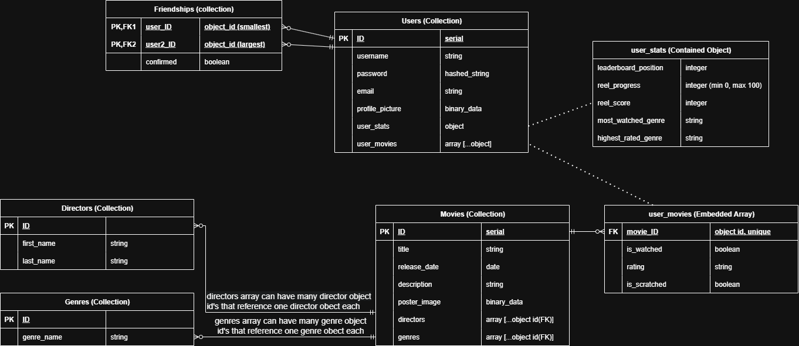

---

## User Stories

This documentation outlines the user stories for four key personas and the core features that address their needs for _The Century Screening Room_ application.

Each persona represents a unique user type whose goals shape our MVP feature set and guide our Agile planning process [(Pichler R, 2025)](https://www.romanpichler.com/blog/personas-epics-user-stories/). These stories form the foundation for future sprints, where they’ll evolve into detailed epics, acceptance criteria, and test cases aligned with MERN full-stack development [(Rehkopf M, 2025)](https://www.atlassian.com/agile/project-management/user-stories).

---

### Persona 1: The Competitor

- A competitive person who loves movies and thrives in competitions
- Wants to track achievements and see their progress
- Wants to climb leaderboards and compare scores with others
- Wants to take on new personalised challenges

#### User Stories: The Competitor

- **Leaderboard Motivation:**

  > As a Competitor, I want to see where I rank on the Reel Leaders leaderboard, so that I can measure my progress against other movie fans.

- **Genre-Based Challenges:**

  > As a Competitor, I want to filter leaderboards by genre, so that I can challenge myself in specific categories I enjoy or want to improve in.

- **Reel Score Tracking:**
  > As a Competitor, I want my Reel Score to update automatically as I watch and rate movies, so that I feel rewarded for every step of progress.

---

### Persona 2: The Collector

- A completionist who wants to conquer the 100 movies of the Reel Canon.
- Finds satisfaction in visually “scratching off” and collecting every title.

#### User Stories: The Collector

- **Scratch-Off Progress:**

  > As a Collector, I want to scratch off movies from the Reel Canon, so that I can visually track my progress toward completing the full list of 100 films.

- **Rating as a Milestone:**

  > As a Collector, I want to rate each movie as I scratch it off, so that I can reflect on my personal journey through the Canon.

- **Completion Satisfaction:**
  > As a Collector, I want to see my Popcorn Box Meter fill up, so that I get a clear sense of achievement as I approach 100% completion.

---

### Persona 3: The Social Planner

- The one who organises movie nights with friends or family.
- Wants to find recommendations based on shared viewing history.
- Relies on the friends system and Reel Comparisons to suggest the next group watch.

#### User Stories: The Social Planner

- **Friend Comparisons:**

  > As a Social Planner, I want to compare my movie list with my friends, so that I can find films we have all watched or ones we are missing.

- **Suggest Unseen Movies:**

  > As a Social Planner, I want the app to suggest movies that neither of us has seen, so that I can easily pick the next movie night choice.

- **Shared Events:**
  > As a Social Planner, I want to invite friends through the platform, so that planning group movie sessions feels connected and fun.

---

### Persona 4: The Curator

- A knowledgeable movie lover who enjoys guiding friends toward great films.
- Wants to create and share Custom Lists (eg., “Top 10 Thrillers” or “Best Movies for a Girls Night”).
- Uses the platform to help others discover new favourites, not just to show off expertise.

#### User Stories: The Curator

- **List Creation:**

  > As a Curator, I want to create custom lists of movies (eg “Top 10 Thrillers”), so that I can share my taste with others.

- **List Sharing:**

  > As a Curator, I want to publish my custom lists for friends to explore, so that they can discover films I think are worth watching.

- **Discovery Through Curation:**
  > As a Curator, I want to see how others interact with my lists, so that I know I’m helping people discover new favourites.

---

### Summary for Future Development Planning

The following high-level examples outline feature areas derived from the user stories above. These will guide sprint planning and backlog creation in future Agile phases, where each feature may evolve into detailed epics, acceptance criteria, and tasks [(Pelegrin J, 2024)](https://www.justinmind.com/blog/examples-user-story-best-practices/).

Future documentation will expand on database design, endpoint mapping, testing, and user-interface components aligned with the MERN stack. These feature areas will inform the next iteration of our Agile sprint backlog, connecting user needs to technical implementation in the MERN application [(Visual Paradigm, 2025)](https://www.visual-paradigm.com/guide/agile-software-development/what-is-user-story/).

| **Epic / Theme**                  | **Linked Feature / Module** | **Linked Persona** | **Goal / Outcome**                                                                                                   |
| --------------------------------- | --------------------------- | ------------------ | -------------------------------------------------------------------------------------------------------------------- |
| **Competition and Leaderboards**  | _Reel Leaders_              | The Competitor     | Enable competitive users to compare Reel Scores and rankings filtered by genre.                                      |
| **Movie Progress and Completion** | _Reel Canon_                | The Collector      | Help users track, rate, and visually complete _The Reel Canon_ through scratch-off interactions and progress meters. |
| **Social Viewing and Planning**   | _Reel Comparisons_          | The Social Planner | Make it easy for friends to plan and share movie sessions through comparisons and group recommendations.             |
| **Curated Lists and Discovery**   | _Custom Lists_              | The Curator        | Empower users to create and share custom lists to inspire new discoveries.                                           |

---

### References - User Stories

**Note:**
The following sources were used to inform best practices and examples for Agile user story documentation, personas, and feature mapping.

| References                                                                                                                                                                                       |
| ------------------------------------------------------------------------------------------------------------------------------------------------------------------------------------------------ |
| Pelegrin, J. (2024). _20 Useful user story examples to get you started_. Justinmind. Available at: <https://www.justinmind.com/blog/examples-user-story-best-practices/> (Accessed 1 Oct. 2025). |
| Pichler, R. (2014). _From Personas to User Stories_. Roman Pichler. Available at: <https://www.romanpichler.com/blog/personas-epics-user-stories/> (Accessed: 1 Oct. 2025).                      |
| Rehkopf, M. (2025). _User stories with examples and a template_. Atlassian. Available at: <https://www.atlassian.com/agile/project-management/user-stories> (Accessed 2 Oct. 2025)               |
| Visual Paradigm. (2025). _What is User Story?_. Visual Paradigm. Available at: <https://www.visual-paradigm.com/guide/agile-software-development/what-is-user-story/> (Accessed: 30 Sep. 2025).  |

---

---

## Ethical Web Development Principles

In 1997, [this software engineering code of ethics (Gotterbarn, D., Miller, K. and Rogerson, S., 1997)](https://dl.acm.org/doi/10.1145/265684.265699) was published by collaboration of IEEE-CS (Institute of Electrical and Electronics Engineers - Computer Society) and ACM (Association for Computer Machinery), becoming the de-facto globally recognized code of ethics for software engineering. Since then, it has remained the global standard, as evidenced by [this wikipedia article (Wikipedia contributors, 2019)](https://en.wikipedia.org/wiki/Programming_ethics) which still cites this code as the standard in the "Programming Ethical Guidelines" section. Since then, both IEEE-CS and ACM maintain an [updated version of the code (Association for Computing Machinery, 2024)](https://www.acm.org/code-of-ethics/software-engineering-code) (currently version 5.2)

From the above code of ethics (henceforth CoE), as well as ACM's respected separately created [Code of Ethics and Professional Conduct (Association for Computing Machinery, 2018)](https://www.acm.org/code-of-ethics) (henceforth CoEPC), we will identify and explain how our planned project will adhere to some of the relevant codes/principles.

---

### Approve Only Safe Software

**CoE 1.03. Approve software only if they have a well-founded belief that it is safe, meets specifications, passes appropriate tests, and does not diminish quality of life, diminish privacy or harm the environment. The ultimate effect of the work should be to the public good:**

This principle is most relevant to our project regarding the handling of personal and login information. As our users will be able to register accounts, providing an email address and password for registration, care must be taken to follow industry practices regarding the handling of such data.

Users unfortunately often re-use passwords across different sites and applications, so compromising our users data could have potentially devastating effects for them. Our plans for ensuring adherence to this principle will require the following:

- **Hashing Passwords:**
  We will use the Bcrypt library to salt and hash the password using the Blowfish cipher prior to storing in the database, rather than storing unsecured plain text.[(Dan Arias, 2021)](https://auth0.com/blog/hashing-in-action-understanding-bcrypt/)
- **Minimum Password Requirements:**
  Using input validation upon account creation to ensure passwords meet standard password security requirements (i.e min length, no common patterns, requiring mixed alphanumeric characters)
- **Protect Routes with JWT Middleware:**
  Generate JWT (JSON Web Token) for each user using the 'jsonwebtoken' library, after validating them on login, and use middleware to authenticate that the request header contains the valid JWT before allowing access to routes containing data unique to the user. In our project, this could be to access their personal information (such as registered email address), as well as other general features specific to the user (such as their personalized movie reviews) [(Khan, H., 2024)](https://dev.to/hamzakhan/securing-your-expressjs-app-jwt-authentication-step-by-step-aom)
- **Testing Exposure of Sensitive Information:**
  Use the external library "Jest" to test routes, JWT generation and validation, and hashing and salting of passwords. Test to ensure that the returned passwords in headers are hashed and salted, and that users cannot access routes without correct authorization through relevant middleware.

---

### Respect Creative Works

**CoEPC 1.5. Respect the work required to produce new ideas, inventions, creative works, and computing artifacts.**

Our proposed project will revolve around movies, and the depiction of those movies will include movie posters. Almost all movie posters are copyrighted creative works, owned by the studio or the artist that produced them, with strict rules on the use of said works.

Additionally, our planned project will make use of many external libraries, including (but not limited to) Express, React, Mongoose, Bcrypt, jsonwebtoken etc. These external libraries each individually have their own licenses detailing terms of use, and adhering to them and the copyright requirements of movie posters can be achieved in the following ways:

- **Following Copyright Requirements:**
  Since this project will be created in Australia, I will be referencing Australian copyright law as outlined by the Australian Copyright Council. The Copyright Act 1968 "allows people to use copyright material without the copyright owner's permission in certain situations, including fair dealing for specific purposes". The Fair Dealings Fact Sheet [(Australian Copyright Council, 2025)](https://s3-ap-southeast-2.amazonaws.com/dimoacc/factsheets/INFO079.pdf?t=2508130836) states: "Under the fair dealing exceptions... copyright material may be used without permission... for one of the specified purposes." Included in the list is "Criticism or review", and expanding on that it is noted "criticism or review... will not be considered to be an infringement... provided that there is sufficient acknowledgement... If the person has other motives... using the material to make a profit or... to divert customers from the competitor – the fact that they have also engaged in a form of criticism or review is not enough to prevent the use from infringing copyright."
  \
  From the above, it is clear that our proposed project meets the copyright requirements around fair use as we will be acknowledging the ownership of the promotional material, not using the material to make a profit, and not diverting customers from competitors using the material. It is important to note that if hosting of the project was to occur in any other country (i.e. hosting our database in New Zealand) we would need to consult the relevant copyright laws of that country and adhere to them. For further legal advice, a request can be submitted to the Copyright Council of Australia or assistance can be provided from the other organizations referenced in their legal advice help page [(Australian Copyright Council, 2025)](https://www.copyright.org.au/legal-advice/)

- **Use Only Licensed External Libraries:**
  Public licensed javascript libraries can be found on the npm website [(npm, 2019)](https://www.npmjs.com/), and list the license used by the package. The relevant license for each package used must be adhered to within the project.
- **Acknowledge Libraries:**
  In the project documentation, we will provide acknowledgement and credit to any external libraries used, as well as listing their licenses, versions and any modifications made. An example of this can be seen in the 'DEPENDENCIES' documentation [(truth-josstice, 2025)](https://github.com/truth-josstice/dev1001_assignment2/blob/main/DEPENDENCIES.md#custom-modified-libraries-used) created by this team for our previous group project.

---

### Consider the Needs of All

**CoE 1.07. Consider issues of physical disabilities, allocation of resources, economic disadvantage and other factors that can diminish access to the benefits of software:**

Our project should strive to be inclusive for all people using it where possible, accounting for differences of physical capabilities and access to software/hardware. This can be achieved in the following ways:

- **Cater for Visually Impaired:**
  The Virtual Screen Reader external library [(guidepup, 2025)](https://www.npmjs.com/package/@guidepup/virtual-screen-reader) allows for tests to be written to test what screen readers will say when accessing the site. In combination with unit testing, writing semantic HTML, and adhering to the guiding principles of [this guide on building a screen reader friendly site (Jaggi, T., 2017)](https://www.accessibility-developer-guide.com/knowledge/screen-readers/how-to-implement/), we can successfully build a site that caters to the visually impaired.
- **Cater for Legacy Hardware and Browsers:** As developers, we are often fortunate to have relatively advanced and powerful hardware, using regularly updated browsers to view content, however it's important to note that many users will be using legacy hardware and browsers. Babel is a transpiler that takes our modern JavaScript code and outputs a set of files with browser compatible syntax, without effecting functionality. Although it can be used online, for our project it would be best installed by following the CLI installation instructions [found here (Babel, 2015)](https://babeljs.io/setup#installation). Additionally, the TinyBench package [(Mohammad Bagher, 2025)](https://www.npmjs.com/package/tinybench) is a simple, lightweight and easy to use benchmarking package we can incorporate into our project to verify performance, referring to the MDN WebDocs section on performance optimization [(MDN Contributors, 2024)](https://developer.mozilla.org/en-US/docs/Learn_web_development/Extensions/Performance/JavaScript). This will ensure our website can run with minimal performance overhead, improving compatibility with low performance hardware.

---

### Respect Privacy

**CoEPC 1.6. Respect privacy:**

Since our project will be collecting and storing some personal data (i.e. email addresses, passwords, friend lists, preferences etc.), we need to ensure we are storing and using this data legitimately, collecting the minimum amount of data needed, and staying informed of the rights and responsibilities of collecting personal data. The Australian Privacy Principles [(OAIC, 2024)](https://www.oaic.gov.au/privacy/australian-privacy-principles/australian-privacy-principles-quick-reference) provide a useful guide for how we can achieve that, and here are some of the ways our project will be adhering to them:

- **Open and transparent management of personal information:**
  Our project will include a privacy policy in its documentation, outlining the types of data collected and how its stored, how we will use it, how it can be accessed, and any other requirements outlined by OAIC [(OAIC, 2023)](https://www.oaic.gov.au/privacy/your-privacy-rights/your-personal-information/what-is-a-privacy-policy). An example of a previously created privacy policy by our team [(truth-josstice, 2025)](https://github.com/truth-josstice/dev1001_assignment2?tab=readme-ov-file#privacy-policy).
- **Security of personal information:**
  As mentioned in the [Approve Only Safe Software](#approve-only-safe-software) section, the use of hashing and salting to secure passwords, JWT middleware to secure routes, and Jest testing to test exposure of sensitive information will all be used to maintain security of personal information.
- **Allow Changing and Deletion of Data:**
  To remain aligned with APP requirements, routes will be created to allow users to update or delete their personal information on the site, including deletion of their account.

### References - Privacy Principles

| References                                                                                                                                                                                                                                                            |
| --------------------------------------------------------------------------------------------------------------------------------------------------------------------------------------------------------------------------------------------------------------------- |
| Gotterbarn, D., Miller, K. and Rogerson, S. (1997). _Software engineering code of ethics._ Available at: <https://dl.acm.org/doi/10.1145/265684.265699> (Accessed: 26 Sep. 2025).                                                                                     |
| Wikipedia contributors (2019). _Programming ethics. Wikipedia._ Available at: <https://en.wikipedia.org/wiki/Programming_ethics> (Accessed: 26 Sep. 2025).                                                                                                            |
| Association for Computing Machinery (2024). _The Software Engineering Code of Ethics and Professional Practice._ Acm.org. Available at: <https://www.acm.org/code-of-ethics/software-engineering-code> (Accessed 26 Sep. 2025).                                       |
| Association for Computing Machinery (2018). _ACM Code of Ethics and Professional Conduct._ Association for Computing Machinery. Available at: <https://www.acm.org/code-of-ethics> (Accessed 26 Sep. 2025).                                                           |
| Dan Arias (2021). _Hashing in Action: Understanding bcrypt._ Auth0 - Blog. Available at: <https://auth0.com/blog/hashing-in-action-understanding-bcrypt/> (Accessed 27 Sep. 2025).                                                                                    |
| Khan, H. (2024). _Securing Your Express.js App: JWT Authentication Step-by-Step._ DEV Community. Available at: <https://dev.to/hamzakhan/securing-your-expressjs-app-jwt-authentication-step-by-step-aom> (Accessed 27 Sep. 2025).                                    |
| Australian Copyright Council (2025). _Fair Dealing: What Can I Use?_ Amazonaws.com. Available at: <https://s3-ap-southeast-2.amazonaws.com/dimoacc/factsheets/INFO079.pdf?t=2508130836> (Accessed 27 Sep. 2025).                                                      |
| Australian Copyright Council (n.d.). _Legal Advice Service._ Australian Copyright Council. Available at: <https://www.copyright.org.au/legal-advice/> (Accessed 27 Sep. 2025).                                                                                        |
| npm (2019). _npm \| build amazing things._ Npmjs.com. Available at: <https://www.npmjs.com/> (Accessed 27 Sep. 2025).                                                                                                                                                 |
| truth-josstice (2025). _dev1001 assignment2 dependencies_ GitHub. Available at: <https://github.com/truth-josstice/dev1001_assignment2/blob/main/DEPENDENCIES.md#custom-modified-libraries-used> (Accessed 28 Sep. 2025).                                             |
| guidepup (2025). _@guidepup/virtual-screen-reader._ npm. Available at: <https://www.npmjs.com/package/@guidepup/virtual-screen-reader> (Accessed 28 Sep. 2025).                                                                                                       |
| Jaggi, T. (2017). _How to implement websites that are ready for screen reader usage._ Accessibility Developer Guide. Available at: <https://www.accessibility-developer-guide.com/knowledge/screen-readers/how-to-implement/> (Accessed 28 Sep. 2025).                |
| Babel (2015). _Using Babel._ Babeljs.io. Available at: <https://babeljs.io/setup#installation> (Accessed 29 Sep. 2025).                                                                                                                                               |
| Mohammad Bagher (2025). _tinybench._ npm. Available at: <https://www.npmjs.com/package/tinybench> (Accessed 29 Sep. 2025).                                                                                                                                            |
| MDN contributors (2024). _JavaScript performance optimization._ MDN Web Docs. Available at: <https://developer.mozilla.org/en-US/docs/Learn_web_development/Extensions/Performance/JavaScript> (Accessed 29 Sep. 2025).                                               |
| OAIC (2024). _Australian Privacy Principles Quick Reference._ Office of the Australian Information Commissioner. Available at: <https://www.oaic.gov.au/privacy/australian-privacy-principles/australian-privacy-principles-quick-reference> (Accessed 29 Sep. 2025). |
| OAIC (2023). _What is a privacy policy?_ OAIC. Available at: <https://www.oaic.gov.au/privacy/your-privacy-rights/your-personal-information/what-is-a-privacy-policy> (Accessed 30 Sep. 2025).                                                                        |
| truth-josstice (2025). _dev1001 assignment2 Privacy Policy_ GitHub. Available at: <https://github.com/truth-josstice/dev1001_assignment2?tab=readme-ov-file#privacy-policy> (Accessed 28 Sep. 2025).                                                                  |

---

---

## Wireframes

### Home - Browser

.png>)

### Home - Tablet

%20(Tablet).png>)

### Home - Tablet (Menu Unfolded)

%20(Tablet%20-%20Menu).png>)

### Home - Mobile

%20(Mobile).png>)

### Home - Mobile (Menu Unfolded)

%20(Mobile%20-%20Menu).png>)

---

### The ReelCanon - Browser

.png>)

### The ReelCanon - Tablet

 (Tablet).png>)

### The ReelCanon - Mobile

 (Mobile).png>)

---

### User Profile - Browser

.png>)

### User Profile - Tablet

 (Tablet).png>)

### User Profile - Mobile

 (Mobile).png>)

---

### Leaderboard - Browser

.png>)

### Leaderboard - Tablet

 (Tablet).png>)

### Leaderboard - Mobile

 (Mobile).png>)

---

### Sign In - Browser

.png>)

### Sign In - Tablet

 (Tablet).png>)

### Sign In - Mobile

 (Mobile).png>)

---

### Register - Browser

.png>)

### Register - Tablet

 (Tablet).png>)

### Register - Mobile

 (Mobile).png>)
