# Software Development Methodologies

This section explains the Software Development Methodologies and how we plan to implement them in our MERN Full-Stack project: **The Century Screening Room**.

During the planning phase, we considered our project scope, team size and the need for flexibility across the lifecycle. Although we looked at Scrum, we decided that the dedicated roles (eg. Product Owner/Scrum Master) wasn't practical for a team of our size. Instead, we decided responsibilities are shared where every team member contributes to backlog refinement, stand-ups, sprint planning and retrospectives.

By combining both Agile for project management with Kanban for task management, this provided us with a balance of structure and flexibility. Agile guides our sprints and retrospectives, while Kanban provides the visual workflow framework that supports those Agile practices.

Together, these methodologies give us a structured yet adaptable workflow that can evolve across all three phases of the project lifecycle.

---

## Agile Project Management Methodology

Agile is an iterative and incremental project management methodology that focuses on delivering value in short, manageable cycles rather than through a single, rigid plan. Its core philosophy emphasises adaptability, collaboration, transparency, and continuous improvement (Atlassian, 2024). Instead of completing all planning upfront, Agile encourages teams to work in small sprints, gather feedback, and refine their approach as requirements evolve.

By prioritising working outcomes over extensive documentation and responding to change over following a fixed plan, Agile enables teams to stay flexible and maintain momentum even in complex or uncertain projects. Practices such as daily stand-ups, sprint reviews, and retrospectives ensure constant communication, while backlog refinement and prioritisation help keep the team aligned on the most valuable tasks.

For our MERN full-stack project, Agile is particularly effective because it supports:

- A small team structure (group of 3) where roles are shared and collaboration is key.
- An iterative workflow, where we can start with core MVP features and expand in later phases.
- A focus on continuous feedback, both internally (retrospectives) and externally (future user testing).
- Adaptability as requirements shift across back-end and front-end phases.

---

_Diagram Figure 1: Agile Methodology Cycle (iteration, feedback, improvement)_

```mermaid
flowchart LR
    A[Plan Sprint] --> B[Implement Tasks]
    B --> C[Daily Stand-ups<br/>Track Progress]
    C --> D[Review & QA]
    D --> E[Retrospective]
    E --> A

    %% Outline colors only
    style A fill:#000000,stroke:#1565C0,stroke-width:3px
    style B fill:#000000,stroke:#2E7D32,stroke-width:3px
    style C fill:#000000,stroke:#F9A825,stroke-width:3px
    style D fill:#000000,stroke:#AD1457,stroke-width:3px
    style E fill:#000000,stroke:#4527A0,stroke-width:3px
```

---

_Diagram Figure 2: Agile & Kanban Adaptation Example Across Phases 1 (Planning & Design), 2 (Back-End Development) & 3 (Front-End Development)_

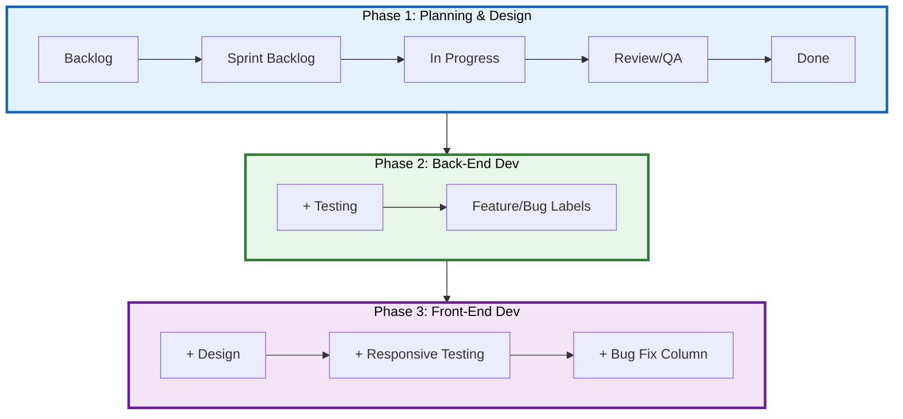

---

## Agile Core Principles We Apply

- **Short development cycles (sprints):** Work is delivered in small, manageable increments each week, allowing us to demonstrate progress regularly and adjust quickly if priorities shift.

- **Continuous feedback and reflection:** Daily stand-ups, sprint reviews, and retrospectives create a loop of constant improvement, ensuring issues are caught early and lessons are applied in the next cycle.

- **Adaptability to change:** Agile values flexibility over rigid planning, which means we can respond to evolving requirements, feedback, or blockers without derailing the entire project.

- **Collaboration and transparency:** Open communication and shared visibility (via Trello, Slack and GitHub) keep all team members aligned, accountable and empowered to contribute equally.

## Implementation of Agile Practices

Working in an Agile approach helps us maintain progress while adapting to changes. It fits our small team and evolving scope by enabling short feedback loops and continuous improvement.

Implementation plan of Agile practices include:

- **Sprints:** Weekly cycles delivering incremental outcomes aligned with MVP requirements.
- **Daily Stand-ups** (Slack): Quick posts covering yesterday’s work, today’s plan, and low/high priority blockers. High-priority blockers are flagged in Trello and raised in stand-ups to highlight risks early, allowing the team to make decisions to re-prioritise if needed.
- **Sprint Planning:** At the start of each sprint, we estimate tasks load, prioritise tasks, assign ownership and define acceptance criteria.
- **Retrospectives:** End of each sprint reviews to evaluate what worked and what needs adjustment. We reflect on successes, challenges and improvements.
- **Definition of Done (DoD):** Each task card requires acceptance criteria and peer review before moving to “Done”, with relevant docs/tests updated.
- **Task Prioritisation:** Dependencies and MVP-aligned tasks prioritised and addressed.
- **Backlog Hygiene:** Regular refinement of epics/stories, keeping scope realistic.
- **Pipeline management:** Regular review against projection of keeping on track with our roadmap timeline throughout the project.
- **Continuous Integration:** Our GitHub workflow (feature branches, PRs, peer reviews, CI checks) ensures quality and aligns with Agile’s principle of continuous delivery.

---

_Diagram Figure 3: Continuous Integration Flow_

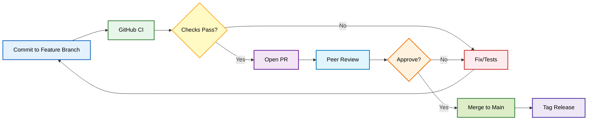

## How Agile and Kanban Integrate

Agile gives us the cadence (sprints, planning, retrospectives). Kanban (in Trello) provides the visual flow to execute those practices day-to-day.

_Diagram Figure 4: Agile & Kanban Methodology Core Principles_

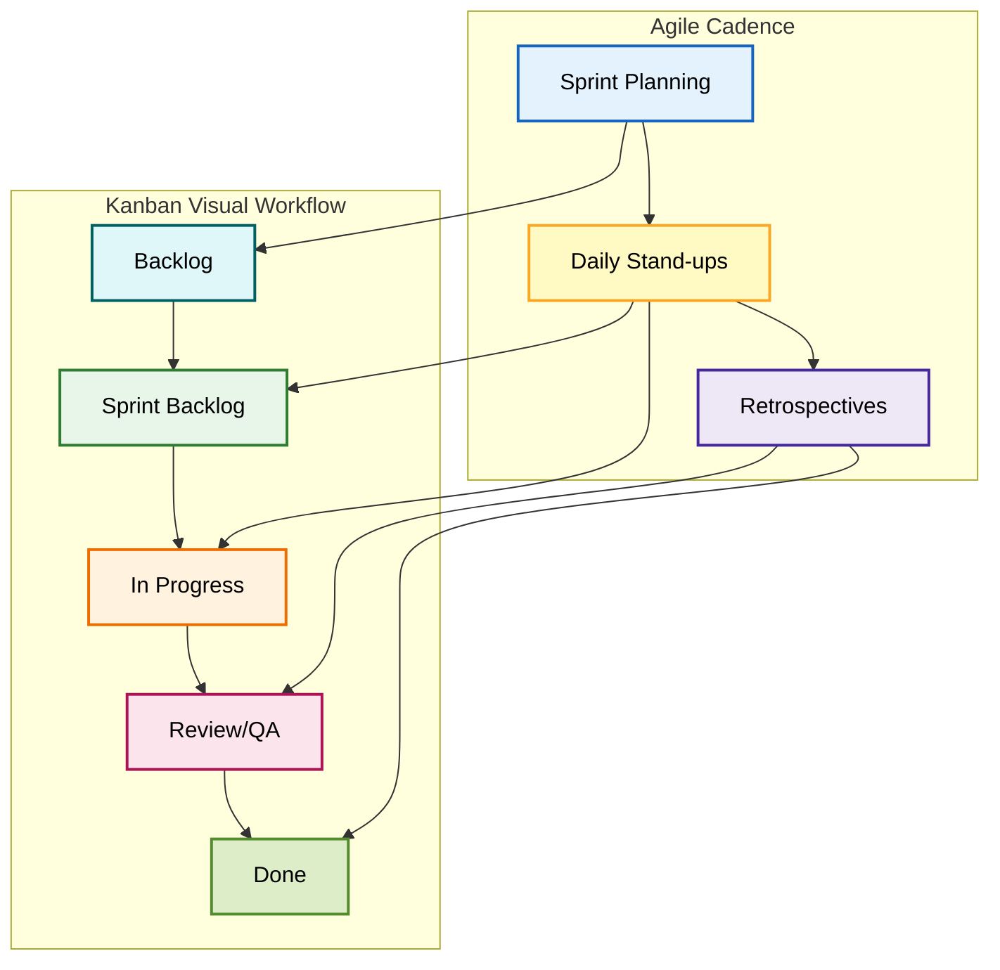

---

## Agile Application Across Phases

We adopted Agile as our overarching methodology because it was suitable for our team size working on a full-stack project that would require flexibility and regular adjustments.

_Diagram Figure 5: Gantt Project Roadmap - Phases 1, 2 & 3_

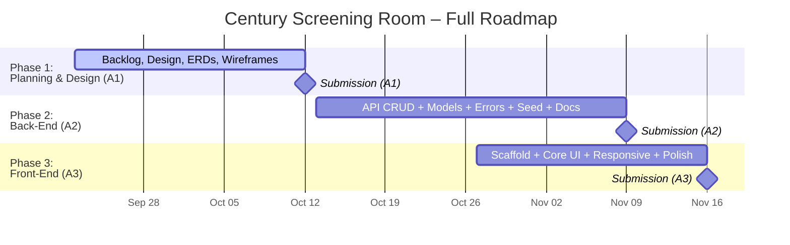

---

### Phase 1 (Planning, Design and Documentation)

- **Sprint goals:** Software architecture and paradigms, methodology, ERDs, wireframes, initial backlog and Definition of Done (DoD).
- **Retrospective focus:** clarity of scope, rubric alignment, task progress update on team alignments, estimation to manage tasks/workload/prioritisation and timeline projections.

_Diagram Figure 6: Gantt Project Roadmap - Phase 1 Planning_

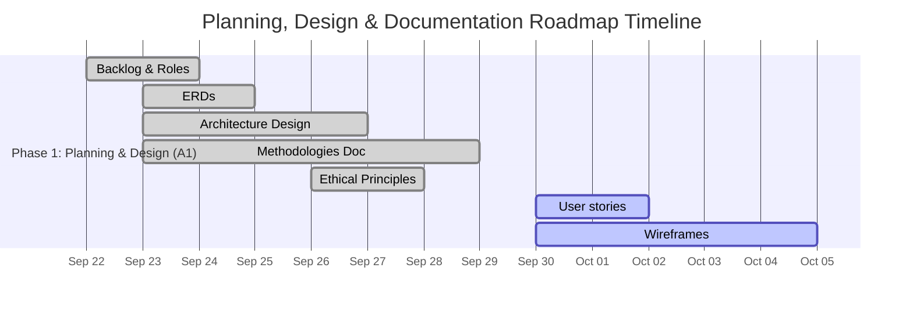

---

### Phase 2 (Back-End Development)

- **Sprint goals:** CRUD endpoints, validation, error handling, seed data, API docs.
- **Retrospective focus:** code quality, debugging and testing coverage, PR review quality, CI checks.

_Diagram Figure 7: Gantt Project Roadmap - Phase 2 Back-End Development_

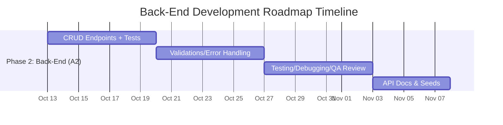

---

### Phase 3 (Front-End Development)

- **Sprint goals:** UI/UX components, state/data flows, ensure responsiveness and accessible UI design
- **Retrospective focus:** usability feedback, user testing, integration issues, ensure responsiveness and accessibility, polish.
- In Phase 3, we could plan to extend Agile feedback loops beyond retrospectives by incorporating user testing sessions, feeding these insights back into backlog refinement

_Diagram Figure 8: Gantt Project Roadmap - Phase 3 Front-End Development_

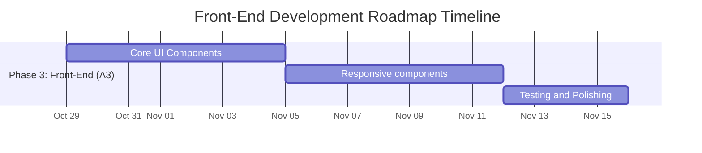

---

## Examples of Agile in Practice

### Phase 1 – Planning, Design & Documentation

#### Example 1: Sprint Planning

1. Define sprint goals aligned with rubric MVPs.
2. Select tasks cards/user stories into sprint and add acceptance criteria and ownership.
3. Run daily Slack stand-ups. Example of our stand-up format:
   - Yesterday’s work and time spent
   - Today’s plan
   - Completion % toward phase goal
   - Low vs high-priority blockers
4. Closed sprint with a retrospective and adjusted for the next cycle.
5. Repeated the cycle of planning → implementing → reviewing → reflecting.

_Diagram Figure 9: Sprint Planning - Sprint Cycle Week_

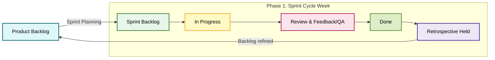

---

#### Example 2: Wireframes Designing

**Task:** Create wireframes for the Reel Canon movie list page (for desktop, tablet, and mobile views).

- **Sprint Planning:**

  - In our sprint planning session, we created a backlog task card in Trello: “Design ReelCanon Wireframes (Desktop + Tablet + Mobile).”
  - The card included acceptance criteria
  - Task assigned to a team member with a checklist for each device layout.
  - Outcome: Drafts in Figma → peer feedback → export PNGs → push to GitHub.

- **Kanban Workflow:**

  - Card moved from Backlog → Sprint Backlog → In Progress during Sprint 2.
  - Daily Slack stand-up example: _“Yesterday I sketched the mobile layout; today I’ll start on tablet responsive design; no blockers so far.”_

- **Review and Feedback (QA):**

  - Once initial drafts were done in Figma, the card was moved to Review column.
  - Other team members provided peer feedback (eg. Make hover effect on desktop and consider alternative options on Tablet and Mobile as 'hover' may not work on these devices).

- **Definition of Done (DoD):**

  - Meeting held to collaborate and reflect and provide feedback for adjustments
  - Final wireframes were exported and uploaded to GitHub repo.
  - The card was moved to Done, with the acceptance criteria checked off.

- **Retrospective:**
  - In the sprint retrospective, we noted that defining acceptance criteria at the start made peer review smoother and reduced rework.

_Diagram Figure 10: Agile & Kanban Workflow for Wireframe Design (Planning Phase)_

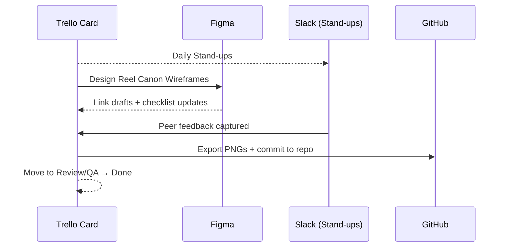

---

### Phase 2 – Back-End Development

#### Example 3: CRUD Endpoint Development

**Task:** Implement the CRUD Route endpoints

- **Sprint Planning:**
  - The team will set sprint goals for full CRUD functionality in a controller
- **Kanban Workflow:**
  - The card moved from Backlog → Sprint Backlog → In Progress.
  - Daily Slack stand-up update example: “Yesterday I scaffolded the controller and model, today I’ll add validation logic and write initial tests. No blockers so far.”
- **Review and Feedback (QA):**
  - Once the code is pushed to a feature branch, a Pull Request is opened to review on GitHub
  - Peer review checked for clarity, naming conventions and testing coverage
- **Definition of Done (DoD):**
  - Endpoint passed local testing via Insomnia/Bruno
  - PR approved and merged into the main branch
  - Update API documentation with example request/response
  - Card moved to Done after all acceptance criteria met
- **Retrospective:**
  - Once code is working, we will review and apply DRY principles
  - We will examine what can be re-used in other CRUD functionality to streamline development

_Diagram Figure 11: Agile & Kanban Workflow for CRUD Endpoint Development (Back-End Phase)_

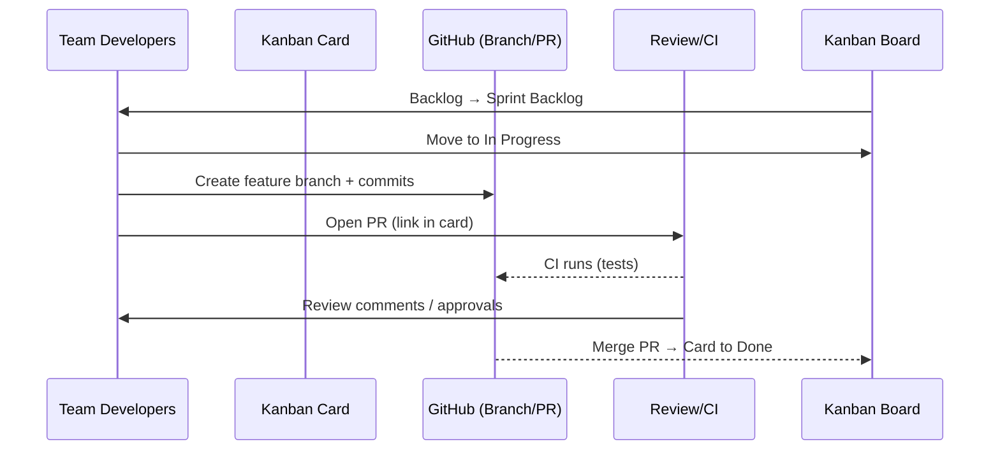

---

### Phase 3 – Front-End Development

#### Example 4: UI/UX Components Development in Practice

**Task:** Build the “Movie Card” component for displaying movies in the Reel Canon list.

- **Sprint Planning:**
  - Create Trello Card: “Build Movie Card Component (responsive)”
  - Tasks examples:
    - Component creation
    - CSS Styling
    - Unit testing
  - Acceptance criteria example:
    - Desktop: grid view with poster images, 'hover effect' shows description
    - Tablet: vertical scrolling grid layout with 'tap to expand' details
    - Mobile: compact cards with 'tap to reveal' overlays for info and rating
- **Kanban Workflow:**
  - The card moved from Backlog → Sprint Backlog → In Progress.
  - Daily Slack stand-up update example: “Yesterday I set up the component scaffold, today I’ll integrate test for hover/tap states. One blocker is deciding final font sizing for mobile.”
- **Review and Feedback (QA):**
  - Commit code to a feature branch, then open PR for review.
  - Peer feedback on styling consistency and accessibility (eg. ARIA labels for screen readers).
  - Make any necessary adjustments before merging.
- **Definition of Done (DoD):**
  - Component tested locally in dev build across desktop, tablet, and mobile breakpoints.
  - Peer-reviewed and merged into main.
  - Wireframes updated to reflect final UI alignment.
- **Retrospective:**
  - Future Example: Discussion about breakpoints criteria to adopt for future responsive components.

_Diagram Figure 12: Agile & Kanban Flow for Front-End Component Development (Movie Card Example)_

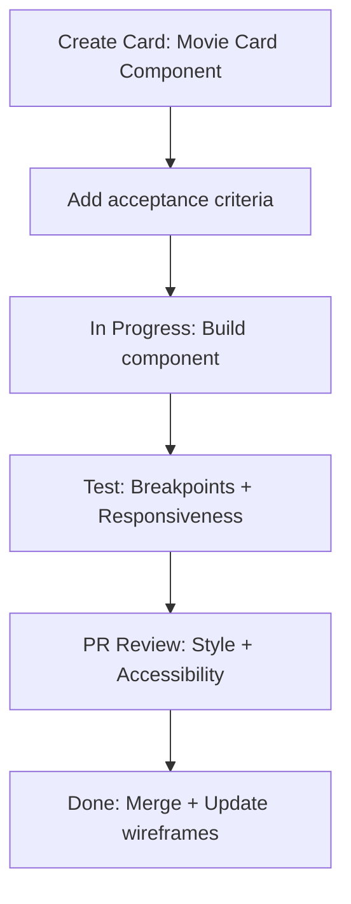

---

## Tools and Technologies

| Tools/Platforms                     | Source                                                                                   | Purpose                                                                                                                                                                                                                |
| ----------------------------------- | ---------------------------------------------------------------------------------------- | ---------------------------------------------------------------------------------------------------------------------------------------------------------------------------------------------------------------------- |
| **Kanban Board**                    | [Trello](https://trello.com/)                                                            | Kanban board for task management and visualisation of workflow                                                                                                                                                         |
| **Communication**                   | [Slack](https://slack.com/)                                                              | Communication for team collaboration, quick communications, daily stand-ups and retrospectives                                                                                                                         |
| **Documentation & Version Control** | [GitHub Repository](https://github.com/CoderAcademy-DEV-MERN-Group/DEV1003-Assessment01) | Central repository for documentation, codebase and version control. Working off individual feature branches and Pull Requests to review documentation and codebase. Tracked changes and accessible for our whole team. |
| **Design/Wireframes**               | [Figma](https://figma.com/)                                                              | Designing wireframes and UX/UI design for across different devices (responsive for Mobile + Tablet + Desktop)                                                                                                          |
| **API Testing**                     | [Insomnia](https://insomnia.rest/) / [Bruno](https://www.usebruno.com/)                  | API Endpoint Testing                                                                                                                                                                                                   |

## References

| Source                                                                                               | Purpose                                                                                                          |
| ---------------------------------------------------------------------------------------------------- | ---------------------------------------------------------------------------------------------------------------- |
| [Atlassian: What is Agile Project Management](https://www.atlassian.com/agile/project-management)    | Detailed overview and guidance on Agile Project Management                                                       |
| [Atlassian: Agile Coach](https://www.atlassian.com/agile)                                            | Agile principles, sprints, stand-ups and guide to align our approach with industry standards and best practices. |
| [Atlassian: Kanban Principles](https://www.atlassian.com/agile/project-management/kanban-principles) | Explains the core Kanban principles and supporting practices                                                     |
| [Miro Blog: Scrum vs. Kanban Boards](https://miro.com/blog/scrum-kanban-boards-differences)          | Comparison of Scrum vs Kanban boards                                                                             |
| [Trello Guide](https://trello.com/guide)                                                             | Trello documentation for setting up and optimising Kanban board setup.                                           |
