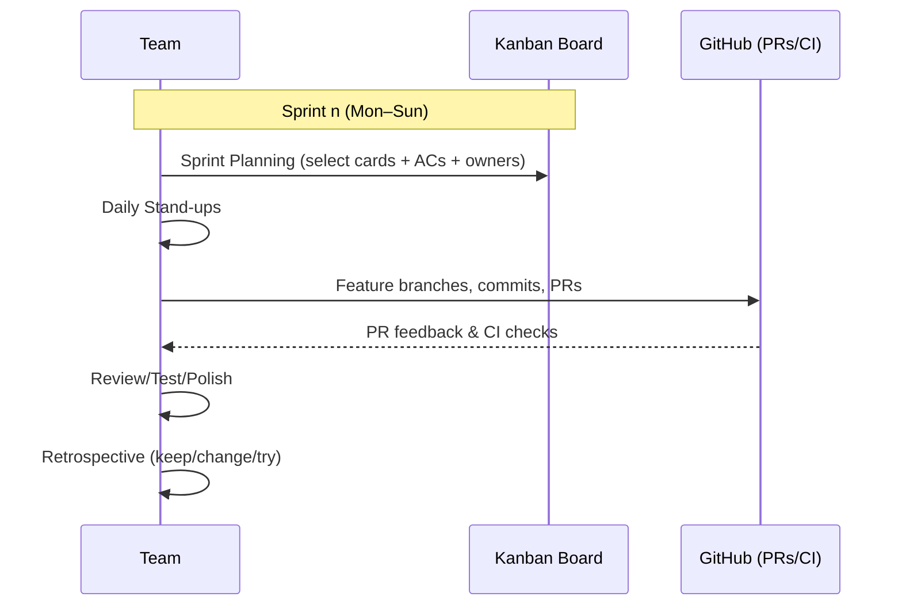
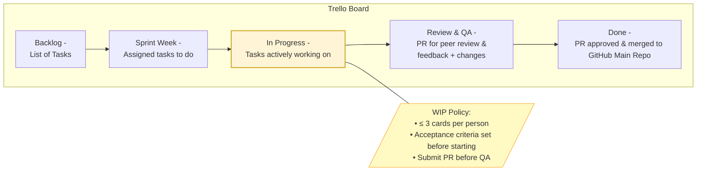
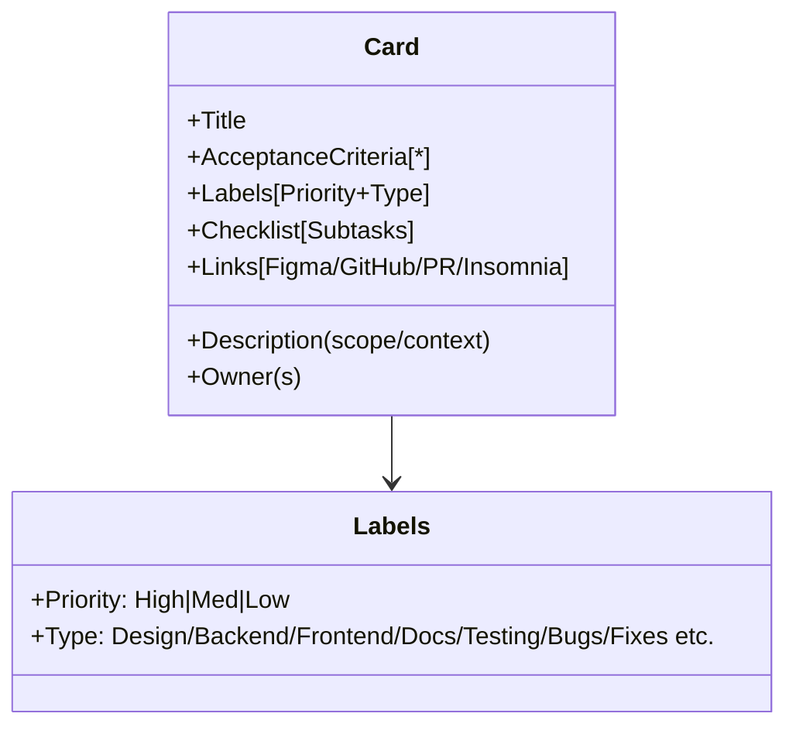
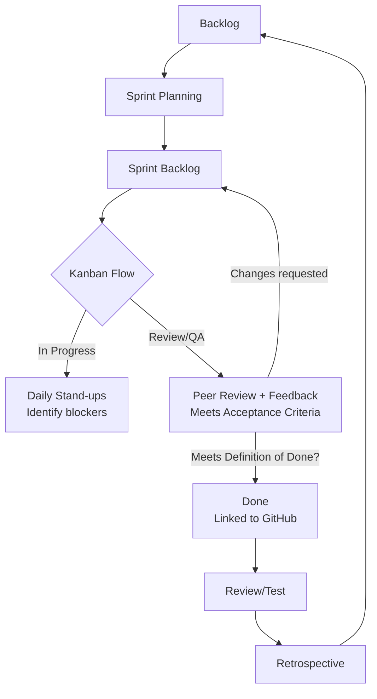
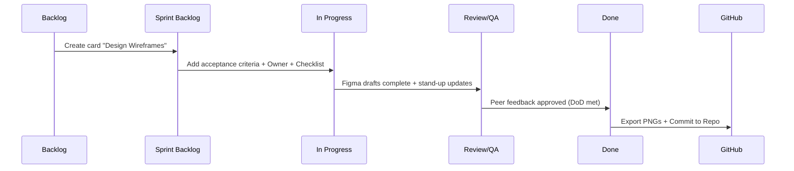
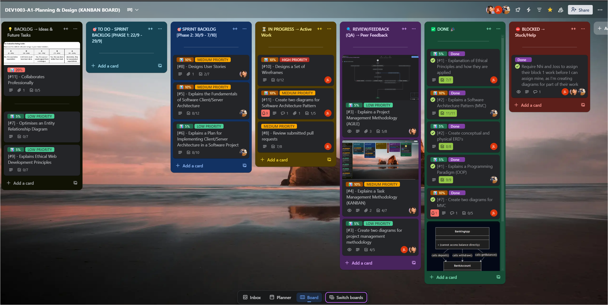

# Kanban Task Management Methodology

We chose Kanban as our Task management Methodology as it provides a visual system for tracking progress, limiting work in progress (WIP), and maintaining a continuous delivery flow. Kanban helps teams visualise workflow, manage priorities, and adapt as requirements change. Work in progress (WIP) limits help maintain focus and prevent overload, while visible progress supports collaboration and shared responsibility across all project phases [(Radigan D, 2025)](https://www.atlassian.com/agile/kanban).

This makes it especially effective for our small team to stay organised and aligned while working in a continuous flow.

## Kanban Methodology Core Principles

- **Visualise the workflow:** Tasks are represented as cards are moved across columns as the status progresses. Kanban board columns make progress visible to all team members at a glance.
- **Limit WIP:** Apply work in progress (WIP) to prevent overload and highlight bottlenecks (eg. < 3 cards per person)
- **Continuous improvement:** Evolve the board as project needs shift.
- **Shared ownership:** No single leader - all team members manage the board.

[(Atlassian, 2025)](https://www.atlassian.com/agile/project-management/kanban-principles)

---

## Implementation of Kanban in Practice

### 1. Agile Integration with Kanban

Our workflow integrates Agile as the overarching Project Management Methodology and Kanban as the Task Management Methodology. Kanban provides the visual structure that makes our Agile process tangible. Together, they provide a balance of structure with adaptability and provide our team with a clear framework for iterative planning, collaboration and visual task tracking while supporting feedback-driven iteration and continuous improvement [(Atlassian, 2025)](https://www.atlassian.com/agile).

Because our project is being completed within a learning environment with assessment timelines, we adopted some Scrum practices, such as sprint planning, daily stand-ups and retrospectives to create a time boxed rhythm and maintain accountability across deliverables. These activities support communication, shared ownership and reflection while keeping our progress aligned with deadlines [(Rehkopf M, 2025)](https://www.atlassian.com/agile/kanban/kanban-vs-scrum). This combined approach aligns with guidance that Agile principles can be applied through various frameworks [(Atlassian, 2025)](https://www.atlassian.com/agile).

**_Diagram Figure 1: Kanban Workflow in Practice_**

---

### 2. Kanban Board

We implement Kanban practices using a **Kanban Board** via Trello, to help us manage tasks represented as cards which move through different stages of development progress. This helps us to monitor progress through clearly defined stages represented as columns on a Kanban Board and maintain shared transparency and accountability.

We created the following columns to represent each stage of the task status for Phase 1 - Planning, Design and Documentation:

- **Backlog** – List of tasks/user stories/ideas
- **Sprint Backlog (To Do)** – Tasks planned for the current sprint
- **In Progress** – Active tasks being worked on (WIP limits applied)
- **Review and Feedback (QA)** – Peer review, feedback and testing
- **Done** – Reviewed and completed tasks (kept visible for accountability), linked and pushed to GitHub central repository for version control.

**_Diagram Figure 2: Trello Kanban Board Structure (Phase 1 Baseline)_**

---

### 3. Cards Breakdown (MVP)

- **Title:** user story or task title description
- **Description:** concise scope and context
- **Acceptance criteria:** reviewable/testable bullet points
- **Labels:** priority (High/Med/Low) + type (eg feature/bug/design/development/testing etc.)
- **Checklist:** subtasks and rubric alignment check off
- **Owner(s):** assigned team member
- **Attachments/links:** Resources eg. Rubric/Figma/GitHub/PR/Insomnia/Bruno

**_Diagram Figure 16: Kanban Task Card Structure (MVP Breakdown)_**

---

As we approach our daily work and assigned tasks, we kept each other up to date via daily stand-ups and weekly retrospectives, to discuss progress and any blockers.

- **Sprint Planning:** Tasks are pulled from Backlog → Sprint Backlog during planning meetings.
- **Daily stand-ups:** Discuss blockers and updates using card statuses on Slack.
- **Retrospectives:** Review WIP limits and productivity and refine Trello columns or other requirements as needed.

**_Diagram Figure 3: Kanban Flow Integrated with Agile Sprint Practices_**

---

## Kanban Implementation Across Project Phases

We plan to adapt our Kanban board structure to suit the different phases of our project considering the specific needs and workflows of each phase. This may include future integration such as GitHub Projects to support visual cues such as metrics, labels, tag releases, milestones, swimlanes and additional columns for Kanban board to better represent the unique tasks and processes involved in each phase.

For example, during development and implementation phases, additional columns like Testing/Debugging, Deployment/CI may be added. Labels (High/Medium/Low), swimlanes and issues/actions could be used to help us to visually identify and manage priorities, blockers, and dependencies. We will apply Agile practices to make adjustments as needed to ensure our approach remains effective and aligned with our project goals.

Below are some **examples** of how we use Kanban and how we may adapt our Kanban Board and for each phase:

**Phase 1 - Planning, Design and Documentation:**

- **What:** Manage documentation tasks such as documentation for programming paradigm, software architecture pattern and design, ERDs, wireframes and project and task management methodologies from drafts to polished versions.
- **How:** “Design Wireframes” card included acceptance criteria, linked Figma files, and followed the full flow Backlog → In Progress → QA → Done as reflected in the diagrams 2 and 3 mentioned above. Flow metrics can be visualised via GitHub tools such as timelines and PR reviews to track review actions and completion.

**Phase 2 - Back-End Development:**

- **What:** Add Testing, Debugging, Deployment and CI related columns/labels and Tasks cards/user stories for endpoints, schemas and controllers and using labels to distinguish attributes such as bug/feature, priorities, blockers etc.
- **How:** “Implement Express Controllers” tracked PRs in GitHub and Insomnia test links. Labels will be used for visual cue such as marking priorities, feature, bug, testing etc.

**Phase 3 - Front-End Development:**

- **What:** Add Design swimlane and Bug Fix column such as for tasks cards/user stories for UI/UX components, accessibility, responsiveness and integration.
- **How:** “Build Leaderboard Component” card includes Figma references, acceptance criteria, and GitHub commits help us to track and visualise any version control changes.

---

### Scenario Example - Phase 1: Planning, Designing and Documentation

**Example Task:** Wireframes Design

| **Column / Stage**         | **Description**                                                                                                                                                                                                              |
| -------------------------- | ---------------------------------------------------------------------------------------------------------------------------------------------------------------------------------------------------------------------------- |
| **Backlog**                | Planning discussions for project design and component features for the app idea and vision, including component criteria for pages such as User Profile, Leaderboard, Reel Canon, Search/Filter box, and Grid Cards.         |
| **Sprint Backlog**         | Task card created for _“Design Wireframes for The Century Screening Room Project”_ and assigned to a team member with acceptance criteria defined.                                                                           |
| **In Progress**            | Task card is moved into _In Progress_ once work has begun.                                                                                                                                                                   |
| **Review / Feedback (QA)** | Feedback provided through Slack messages, Zoom meetings, and screen sharing to ensure Figma designs align with the project’s scope and vision.                                                                               |
| **Done**                   | Export Figma designs and commit them to the repository for Pull Request (PR) review. The Agile cycle is reiterated if necessary until acceptance criteria and the Definition of Done (DoD) are met and approved by the team. |

**_Diagram Figure 4: Kanban Flow Example - Wireframes Design Task_**

---

### Example of our Trello Board Snapshot

---

## References

| References                                                                                                                                                                                    |
| --------------------------------------------------------------------------------------------------------------------------------------------------------------------------------------------- |
| Radigan, D. (2025). _Kanban A Brief Introduction_. Atlassian. Available at: <https://www.atlassian.com/agile/kanban> (Accessed 23 Sep. 2025).                                                  |
| Atlassian (2025). _4 Kanban Principles for Agile Project Management_. Atlassian. Available at: <https://www.atlassian.com/agile/project-management/kanban-principles> (Accessed 23 Sep. 2025). |
| Rehkopf, M. (2025). _Kanban vs. Scrum: Which Agile Are you?_ Atlassian. Available at: <https://www.atlassian.com/agile/kanban/kanban-vs-scrum> (Accessed 8 Oct. 2025).                        |
| Atlassian (2025). _What is Agile?_. Atlassian. Available at: <https://www.atlassian.com/agile> (Accessed 23 Sep. 2025).                                                                        |
