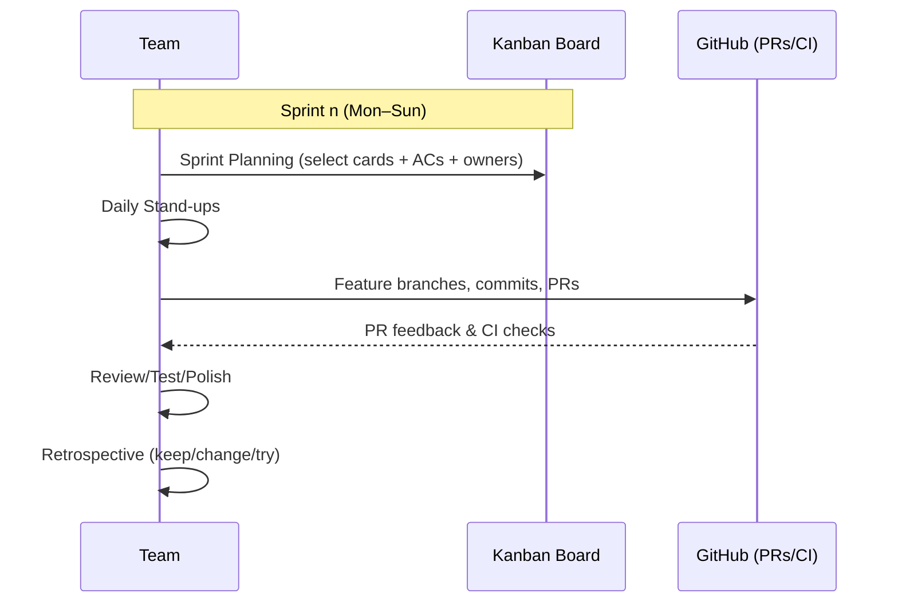
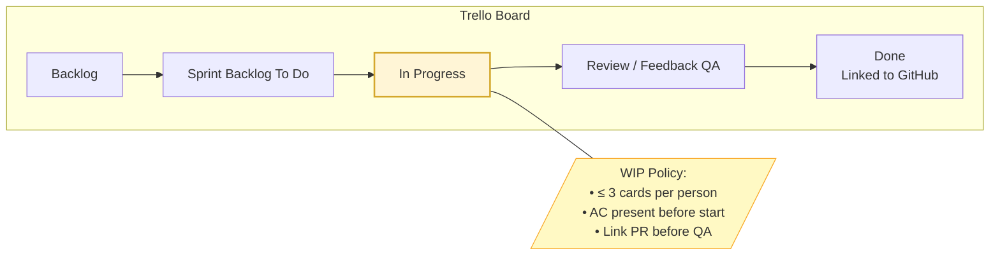
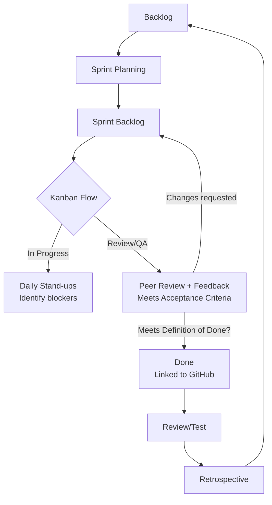
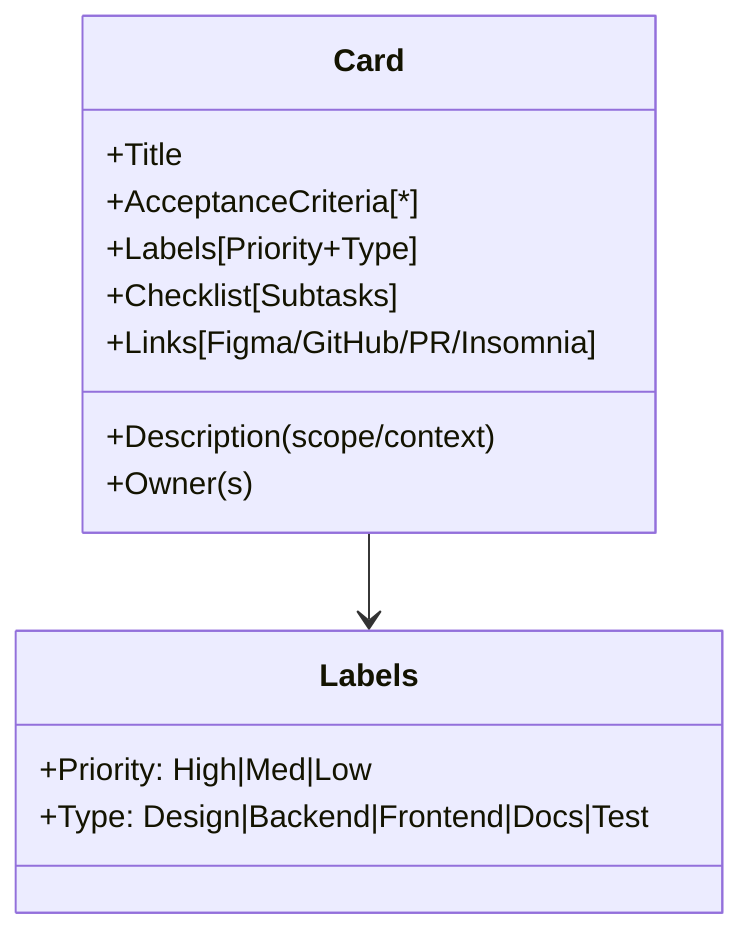
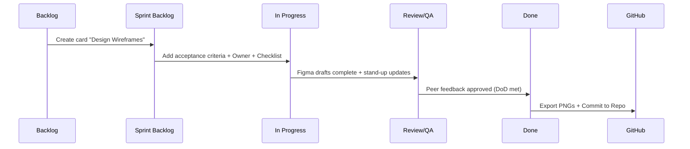

# Kanban Task Management Methodology

Kanban is a visual workflow management framework that emphasises transparency, limiting work-in-progress (WIP), and continuous flow (Atlassian, 2024).

We chose Kanban because it provides a clear, shared view of work and complements Agile by offering a simple, visible way to manage tasks. Kanban helps our team visualise workflow, manage priorities, and adapt as requirements shift. This makes it especially effective for a small team working across three project phases.

## Kanban Methodology Core Principles

- **Visualise the workflow:** Tasks are represented as cards are moved across columns as the status progresses. Kanban board columns make progress visible to all team members at a glance.
- **Limit WIP:** Apply work in progresss (WIP) to prevent overload and highlight bottlenecks (eg. < 3 cards per person)
- **Continuous improvement:** Evolve the board as project needs shift.
- **Shared ownership:** No single leader — all team members manage the board.

*Diagram Figure 13: Kanban Workflow in Practice (Team, Trello, GitHub)*

## Implementation of Kanban in Practice

We use Kanban via Trello as our task management framework to visualise workflow and manage priorities.

### Kanban Board Structure

We implemented our Kanban board in Trello with the following columns for Phase 1 - Planning, Design and Documentation:

- **Backlog** – Ideas & future tasks
- **Sprint Backlog (To Do)** – Tasks planned for the current sprint
- **In Progress** – Active tasks being worked on (WIP limits applied)
- **Review and Feedback (QA)** – Peer review, feedback and testing
- **Done** – Reviewed and completed tasks (kept visible for accountability), linked and pushed to GitHub central repository for version control.

*Diagram Figure 14: Trello Kanban Board Structure (Phase 1 Baseline)*

---

### Agile Integration with Kanban

- **Sprint Planning:** pull task cards from Backlog → Sprint Backlog
- **Daily stand-ups:** reference card status
- **Retrospectives:** to adjust WIP limits/columns if flow stalls.

*Diagram Figure 15: Kanban Flow Integrated with Agile Sprint Practices*

## Kanban Board Evolution Across Phases

During development and implementation phases, additional columns like Testing/Debugging, Deployment/CI may be added. Labels (High/Medium/Low) and swimlanes help manage priorities, blockers, and dependencies.

**Phase 1 - Planning, Design and Documentation:**

- Baseline columns (above) with tasks cards for ERDs, wireframes, methodologies, roles etc.

**Phase 2 - Back-End Development:**

- Add Testing, Debugging, Deployment and CI related columns/labels
- Eg. Tasks cards/user stories for endpoints, schemas, controllers, error handling, seed data and using labels to distinguish attributes such as bug/feature, priorities, blockers etc.

**Phase 3 - Front-End Development:**

- Add Design swimlane and Bug Fix column such as for tasks cards/user stories for UI/UX components, accessibility, responsiveness and integration.

*Diagram Figure 16: Kanban Task Card Structure (MVP Breakdown)*

## Cards Breakdown (MVP)

- **Title:** user story or task title description
- **Description:** concise scope and context
- **Acceptance criteria:** reviewable/testable bullet points
- **Labels:** priority (High/Med/Low) + type (eg feature/bug/design/development/testing etc.)
- **Checklist:** subtasks and rubric alignment check off
- **Owner(s):** assigned team member
- **Attachments/links:** Resources eg. Rubric/Figma/GitHub/PR/Insomnia/Bruno

---

## Kanban in Practice - Examples

### Phase 1: Planning, Designing and Documentation

**Example Task:** Wireframes Design

- **Backlog:** Planning discussions for project design and component features for the app idea and vision including component criterias for pages including for User Profile, Leaderboard, Reel Canon, Search/filter box, grid cards etc.s
- **Sprint Backlog:** Task card created for "Design Wireframes for The Century Screening Room Project” and assigned team member with acceptance criterias
- **In Progress:** Task card is moved along to in progress when being worked on.
- **Review/Feedback (QA):** Slack feedback, Zoom meeting calls and screensharing to discuss Figma design aligned to project scope and vision.
- **Done:** Export Figma designs and commit to repo for PR review and reiterate Agile cycle if necessary until acceptance criteria and DoD has been met and approved my team.

---

### Example of our Trello Board Snapshot

